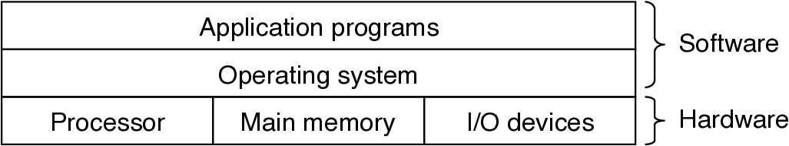
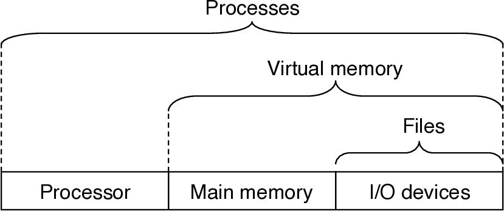
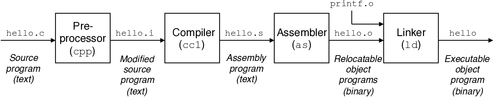
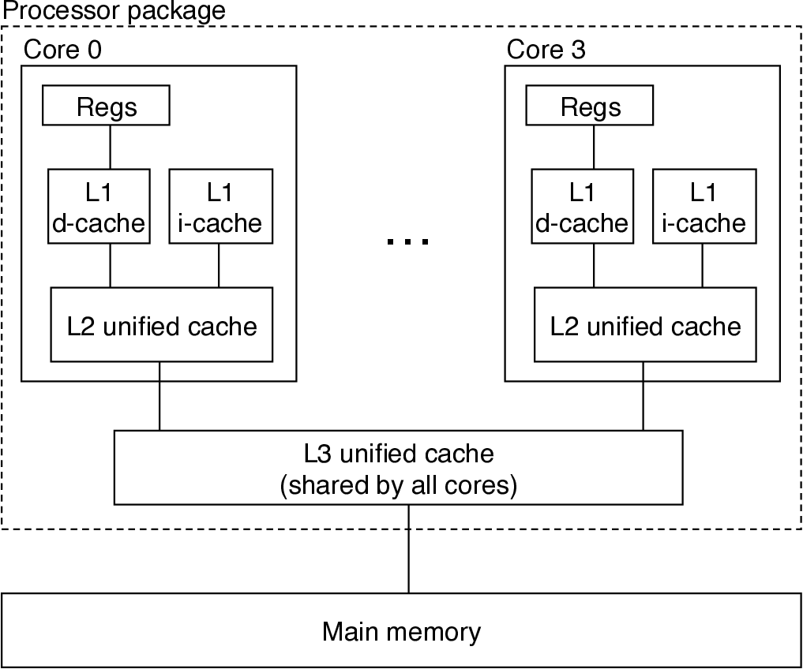
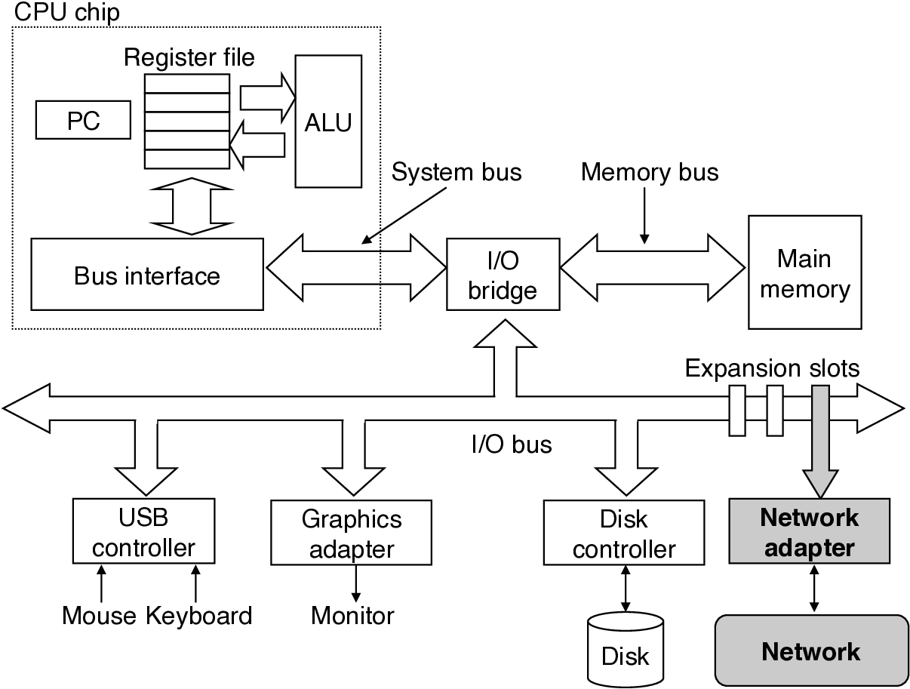

# Computer Architecture
CS:APP3e.ch01


---

## Overview
- Course theme: Balancing abstraction with real-world understanding
- Key realities of computer systems
- Role of the course in the CS curriculum

---

## Course Theme: Abstraction Is Good, But Reality Matters


- CS courses emphasize abstraction e.g., 
  - abstract data types, 
  - asymptotic analysis of algorithms
- Abstraction has limits, especially when debugging or optimizing
- Understanding implementation details improves:
  - Programming effectiveness
  - Bug detection and elimination
  - Performance tuning
- Prepares you for advanced systems courses e.g., 
  - OS, Compilers, Networks, Embedded Systems

---

## Great Reality ❶: Ints Are Not Integers, Floats Are Not Reals
- **Example 1:** Is x² ≥ 0?
  - Floats: Yes
  - Integers:
    - 40000 * 40000 → 1600000000
    - 50000 * 50000 → Overflow
- **Example 2:** Is (x + y) + z = x + (y + z)?
  - Integers: Yes
  - Floats:
    - (1e20 + -1e20) + 3.14 → 3.14
    - 1e20 + (-1e20 + 3.14) → ?
- 📝 Practice: try various value limits in [ov.c](./code/ov.c)

---

## Computer Arithmetic
- Arithmetic operations are predictable but not always intuitive
- Mathematical properties don't fully apply due to finite representation:
  - **Integers**: Commutative, associative, distributive
  - **Floats**: Monotonic but subject to rounding errors
- Key takeaway: Understand context to avoid errors in programming and compiling

---

## Great Reality ❷: You Need to Understand Assembly


- You may not write assembly, but understanding it is essential for:
  - Debugging
  - Understanding compiler optimizations and inefficiencies
  - Performance tuning
  - Writing system software (OS, compilers)
  - Security (malware analysis, reverse engineering)
- Assembly is critical for low-level programming and systems understanding
- 📝 Go through the compilation procedure
  ```bash
  # ⓐ By gcc only
  # 1. Preprocessing: ov.c → ov.i
  gcc -E ov.c -o ov.i # or cpp 
  # 2. Compilation: ov.i → ov.s
  gcc -S ov.i -o ov.s # or gcc -S ov.c -o ov.s
  # 3. Assembly: ov.s → ov.o
  gcc -c ov.s -o ov.o # or gcc -c ov.c -o ov.o
  # 4. Linking: ov.o → ov
  gcc ov.o -o ov      # or gcc ov.c -o ov
  # 5. gcc automates all these procedures
  gcc ov.c -o ov

  # ⓑ Extra work is needed for separate tools
  # 1. Preprocessing: ov.c -> ov.i
  cpp ov.c > ov.i
  # 2. Compilation: ov.i -> ov.s
  gcc -S -o ov.s ov.i 
  # 3. Assembly: ov.s -> ov.o
  as -o ov.o ov.s
  # 4. Linking: ov.o -> ov
  # you can find the dynamic linker by: ldd /bin/ls
  ld -o ov ov.o -lc -dynamic-linker /lib64/ld-linux-x86-64.so.2
  ```
- You need to manually add the following code to ov.s for ⓑ 3
  ```assembly
  .section .text
  .globl _start
  _start:
      call main
      movl $0, %edi  # Return 0 (exit code)
      call exit
  ```

---

## Great Reality ❸: Memory Matters


- **Memory Is Limited and Needs Management**
  - Applications often constrained by memory
- **Bugs Are Difficult to Trace**
  - Memory bugs can manifest far from the source
- **Performance Is Affected by Memory Access**
  - Cache and virtual memory significantly impact speed
  - Optimizing for memory architecture boosts performance

---

## Memory Bug Example
```c
typedef struct {
    int a[2];
    double d;
} struct_t;

double fun(int i) {
    volatile struct_t s;
    s.d = 3.14;
    s.a[i] = 1073741824;  // Potential out-of-bounds access
    return s.d;
}
```
- Different results depending on system and compiler:
  - fun(0) → 3.14
  - fun(2) → 3.139...
  - fun(6) → Segmentation fault
- 📝 Practice: trigger segmentation fault from [fun.c](./code/fun.c)

---

## Memory Referencing Errors and Solutions
- **Common Issues**
  - Out-of-bounds access, invalid pointers, malloc/free misuse
- **Consequences**
  - Unpredictable bugs, delayed effects, corrupted data
- **Solutions**
  - Use safe languages (Java, Python, Rust) or detection tools (Valgrind)
  - Understand and anticipate memory interactions

---

## Great Reality ❹: Performance Involves More than Asymptotic Complexity
- Constant factors and implementation details matter
- Performance varies significantly (10x differences) based on code structure
- Optimization requires:
  - Algorithmic improvements
  - Efficient data handling
  - Careful loop and procedure design
- System knowledge is essential for effective optimization

---

## Memory System Performance Example
```c
void copyji(int src[2048][2048], int dst[2048][2048]) {
    for (int j = 0; j < 2048; j++)
        for (int i = 0; i < 2048; i++)
            dst[i][j] = src[i][j];
}

void copyij(int src[2048][2048], int dst[2048][2048]) {
    for (int i = 0; i < 2048; i++)
        for (int j = 0; j < 2048; j++)
            dst[i][j] = src[i][j];
}
```
- copyij: 4.3ms | copyji: 81.8ms (Intel i7)
- Cache efficiency explains the performance gap
  - 
- 📝 Practice: find the code performance of [perf.c](./code/perf.c) specific to your system

---

## Great Reality ❺: I/O and Networking Matter


- Performance and reliability depend on data movement
- Systems must handle:
  - I/O bottlenecks
  - Network reliability and concurrency
  - Platform differences and performance tuning

---

## Course Role in [CS Curriculum](https://catalog.floridapoly.edu/preview_program.php?catoid=35&poid=1567)
- Foundation for systems courses (OS, Networking, Compilers)
- Clarifies core principles underlying computer systems
- Prepares students for building real-world software

---

## Textbooks
- [Computer Systems: A Programmer's Perspective, 3e](http://csapp.cs.cmu.edu/)
- [The C Programming Language, 2e](https://www.cs.sfu.ca/~ashriram/Courses/CS295/assets/books/C_Book_2nd.pdf)
- [x86-64 Assembly Language Programming with Ubuntu](https://open.umn.edu/opentextbooks/textbooks/733)

---

## Tentative Topics
- Programs and Data
  - Bit operations, assembly, data representation
- Memory Hierarchy
  - Caching, memory technology, locality
- Exceptional Control Flow
  - Processes, signals, Unix control flow
- Virtual Memory
  - Address translation, memory allocation
- Networking and Concurrency
  - Threads, synchronization, web proxy development