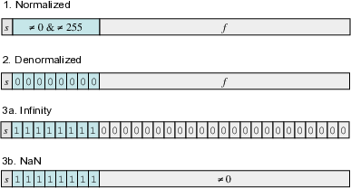
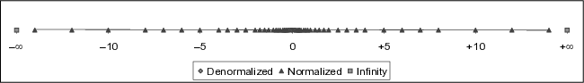
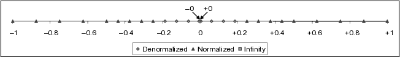

# Representing and Manipulating Information
CS:APP3e.ch02

Floating Point
---

## Decimal notation of rational numbers
- Base 10: *decimal point*
  - $2025.5205_{10} = 2 \times 10^3 + 0 \times 10^2 + 2 \times 10^1 + 5 \times 10^0 + 5 \times 10^{-1} + 2 \times 10^{-2} + 0 \times 10^{-3} + 5 \times 10^{-4}$
- Base 2: *binary point*
  - $11011.11011_2 = 1 \times 2^4 + 1 \times 2^3 + 0 \times 2^2 + 1 \times 2^1 + 1 \times 2^0 + 1 \times 2^{-1} + 1 \times 2^{-2} + 0 \times 2^{-3} + 1 \times 2^{-4} + 1 \times 2^{-5}$
- Base 16: *hexadecimal point*
  - $feed.beef_{16} = 15 \times 16^3 + 14 \times 16^2 + 14 \times 16^1 + 13 \times 16^0 + 11 \times 16^{-1} + 14 \times 16^{-2} + 14 \times 16^{-3} + 15 \times 16^{-4}$
- 📝 Practice
  - Convert $2025.5205_{10}$ to binary and hexadecimal
  - Convert $11011.11011_2$ to decimal and hexadecimal
  - Convert $feed.beef_{16}$ to binal and decimal
- 📝 Practice
  - What will happen when we move the point leftward or rightward?

---

## Generalized Formula for a Rational Number $R$ in Base $b$
- $R = I + F = (d_n d_{n-1} \dots d_1 d_0 . d_{-1} d_{-2} \dots d_{-m})_b$
  - Integer part = $I = \sum_{i=0}^n d_i \cdot b^i$
  - Fractional part = $\sum_{j=1}^m d_{-j} \cdot b^{-j}$
  - The $b$ digits $d_i,\ i=0,1,⋯, b-1$ must satisfy $0 \leq d_i < b$.
- **Fractional binary numbers**
  - $R = I + F = (d_n d_{n-1} \dots d_1 d_0 . d_{-1} d_{-2} \dots d_{-m})_2$
  - = $\sum_{i=0}^n d_i \cdot 2^i + \sum_{j=1}^m d_{-j} \cdot 2^{-j}$
  - binary digits: 0,1
- 📝 Represent the fractional decimal numbers in fractional binary numbers
  - 5 and 3/4, 3 and 7/8, 1 and 11/16
- 📝 What is the limit of 0.1111111⋯₂ when the number of digit 1 → ∞?
  - 0.1111111⋯₂ is notated as 1.0-ϵ

---

## Limitations of fractional binary numbers
- Limitation ➊: 
  - Can only exactly represent numbers of the form x/2ᵏ
  - Other rational numbers have repeating bit representations

| Value   | Representation    |
|---------|---------------------------------|
| 1/3     | 0.0101010101[01]…₂|
| 1/5     | 0.001100110011[0011]…₂   |
| 1/10    | 0.0001100110011[0011]…₂  |

- Limitation ➋:
  - Just one setting of binary point within the w bits
    - called `fixed-point`
  - Limited range of numbers (📝 find the range of $w_i$ bits.$`w_f`$ bits)
- 📝 Convert 314, 3.14, 3/14 into fractional binary numbers
  - check your solution with [r2b.py](./code/r2b.py)

---

## IEEE Floating Point Standard  
- Established in 1985 as a uniform standard [IEEE 754](https://en.wikipedia.org/wiki/IEEE_754) for floating-point arithmetic.    
- Driven by numerical concerns:  
  - Standards for rounding, overflow, and underflow.  
  - Ensures consistency across hardware and software.  
- Supported by all major CPUs.

---

## Floating Point Representation  
- Uses $V = (-1)^s \cdot M \cdot 2^E$ to represent a `wide range` of rational numbers
  - **Sign bit (s):** Determines if the number is negative or positive.  
  - **Significand (M):** Fractional value in the range [0,1) ∪ [1.0, 2.0).  
  - **Exponent (E):** Weights the value by a power of 2. 
- Encoding:  
  - **Sign bit (s):** 1 bit (1 negative, 0 positive)
  - **Exponent (exp):** encodes E (biased)
  - **Fraction (frac):** encodes M (called Mantissa)
    - represents the fractional value $0≤ f <1$
- Supports efficient computations on very large $|V|≫0$ and very small $|V|≪1$
  - a set of finite numbers: 
    - `normalized` values, 
    - `denormalized` values (including `+0` and `-0`)
  - two infinities: `+∞` and `-∞`
  - two kinds of NaN: a quiet NaN (`qNaN`) and signaling NaN (`sNaN`)
    - Quiet bit is the MSB of the mantissa. Set for qNaN, cleared for sNaN.

---

## Precision Options  
| Precision | Total Bits | Sign Bit (s) | Exponent (exp) | Fraction (frac)  |
|------|------------|----------|----------|-------|
| Single Precision | 32  | 1 | 8 | 23      |
| Double Precision | 64  | 1 | 11| 52      |
| [Extended Precision](https://en.wikipedia.org/wiki/Extended_precision) (x86 architectures) | 80  | 1 | 15| 63/64|

- Categories of single-precision floating-point values
  - 

---

## Normalized Values
- Values with  `000…0 < exp < 111…1=2ᵏ` as unsigned integer
  - i.e. exp in the range 1 to 2ᵏ-2
- Exponent:  $E = \text{exp} - \text{bias}$  
  - bias  = 2ᵏ⁻¹ - 1 
  - where $k$ is the number of exponent bits.  

| Precision  | Exponent Bits (k) | bias (2ᵏ⁻¹ - 1) | Exponent Range (exp) 1 to 2ᵏ-2 | Actual Exponent (E) -(2ᵏ⁻¹-2) to 2ᵏ⁻¹ - 1 |
|------------|-------------------|------------------|----------------------|---------------------|
| Single Precision    | 8        | 127     | 1 to 254    | -126 to 127 |
| Double Precision    | 11       | 1023    | 1 to 2046   | -1022 to 1023       |
| Extended Precision  | 15       | 16383   | 1 to 32766  | -16382 to 16383     |

- Significand coded with `implied leading 1`: $M = 1+f = 1.\text{frac}$  
  - Minimum when frac=000⋯0 ($M_{min} = 1.0$)
  - Maximum when frac=111⋯1 ($M_{max} = 2.0 – ε$)
- 📝 For each precision, find
  - the total number of normalized values (don't miss the sign bit)
    - $`2 ⋅ 2^m ⋅ (2^k - 2)`$
  - the (maximum, minimum) normalized values in magnitude
    - ($M_{max} ⋅ 2^{E_{max}}$, $M_{min} ⋅ 2^{E_{min}}$)

---

## 🍎 Encoding the Number 6.75 in IEEE 754 Single Precision
- ➊ Convert to binary: 6.75 → 110.11
- ➋ Normalize the binary number: 110.11 → 1.1011 × 2² = 1.10110000000000000000000 × 2²
  - ∴ frac = 10110000000000000000000 (drop the leading 1.), E = 2
- ➌ Calculate the biased exponent:
  - $E = \text{exp} - \text{bias} ⇒ 2 = \text{exp} - 127 ⇒ \text{exp}=129=10000001_2$
- ➍ Assemble the components: 

| Component  | Bits                      | Value                     |
|------------|---------------------------|---------------------------|
| Sign       | 1                         | 0 (positive)              |
| Exponent   | 8                         | 10000001 (129 in decimal) |
| Fraction   | 23                        | 10110000000000000000000   |

- Final IEEE 754 encoding (Hex): `0x40D80000`
- 📝 Encode -6.75 in IEEE 754 single precision and double precision
  - Check your solution with [me.c](./code/me.c) or [r2f.py](./code/r2f.py)

---

## [Denormalized Values](https://en.wikipedia.org/wiki/Subnormal_number)
- Values with `exp = 000…0`
  - used to fill the gap between `zero` and the `smallest normalized number in magnitude` (what is it?)
- Exponent designed as: $E = 1 - \text{bias}$  (instead of $E = 0 - \text{bias}$)
- Significand coded with implied leading 0:  $M = f = 0.\text{frac}$
  - This allows for a gradual underflow and smaller numbers to be represented
- Special cases:  
  - **Zero:** `exp = 000…0`, `frac = 000…0`
    - Note +0 and -0 has distinct code 
  - **Numbers very close to Zero:** `exp = 000…0`, `frac ≠ 000…0`
    - These numbers are equispaced (what is the space?)
- 🍎 Single Precision (32-bit)
  - The smallest normalized number:  
    - $1.0 \times 2^{-126} \approx 1.17549410^{-38}$
  - The smallest denormalized number: 
    - $0.00000000000000000000001_2 \times 2^{-126} = 2^{-23} \times 2^{-126} = 2^{-149}≈1.401298^{-45}$
- 📝 find the smallest normalized number and denormalized number for double, long double
  - verify your solution with [min.c](./code/min.c)

---

## Special Values  
- `∞` with `exp = 111…1`, `frac = 000…0`.
  - Represents overflow or division by zero. 
  - e.g., 1.0/0.0 = −1.0/−0.0 = +∞,  1.0/−0.0 = -1.0/0.0 = −∞
- `NaN` (Not a Number) with `exp = 111…1`, `frac ≠ 000…0`.  
  - Represents undetermined results (e.g., $\sqrt{-1}$, ∞-∞, 0/0).  
- 📝 Practice these special values in [C](./code/sv.c)

---

## Distribution of Floating-Point encodings

| **Category**    | **Sign Bit** | **Exponent**       | **Mantissa**       | **Description**                                                   |
|-----------------|--------------|--------------------|--------------------|-------------------------------------------------------------------|
| **NaN**         | 1            | All 1s             | Non-zero           | Not a Number, represents undefined or unrepresentable results.    |
| **−∞**          | 1            | All 1s             | All 0s             | -∞, represents the smallest possible value.        |
| **−Normalized** | 1            | Not all 0s or 1s   | Normalized         | Negative real numbers with full precision.                        |
| **−Denorm**     | 1            | All 0s             | Non-zero           | Very small negative numbers close to zero, with reduced precision.|
| **−0**          | 1            | All 0s             | All 0s             | Negative zero, distinct from +0 in some operations.               |
| **+0**          | 0            | All 0s             | All 0s             | Positive zero, distinct from −0 in some operations.               |
| **+Denorm**     | 0            | All 0s             | Non-zero           | Very small positive numbers close to zero, with reduced precision.|
| **+Normalized** | 0            | Not all 0s or 1s   | Normalized         | Positive real numbers with full precision.                        |
| **+∞**          | 0            | All 1s             | All 0s             | + ∞, represents the largest possible value.         |
| **NaN**         | 0            | All 1s             | Non-zero           | Not a Number, represents undefined or unrepresentable results.    |

## Interesting Floating Point Values
| **Type** | **Bit Representation**| **Fraction/Significand (M)** | **Exponent (E)**  | **Numeric Value (V)** |
|-----|------------|-----|---------|---|
| **+0.0** | All zeros  | $M = 0$   | $E = 0$  | $V = 0$ |
| **Smallest Positive Denormalized**| 1 in the least significant bit, otherwise all zeros| $M = f = 2^{-m}$ | $E = -2^{k-1} + 2$ | $V = 2^{-m - 2^{k-1} + 2}$  |
| **Largest Denormalized**| Exponent field: all zeros; Fraction field: all ones| $M = f = 1 - 2^{-m}$| $E = -2^{k-1} + 2$ | $V = (1 - 2^{-m}) \times 2^{-2^{k-1} + 2}$ |
| **Smallest Positive Normalized**  | 1 in the least significant bit of the exponent field, otherwise all zeros   | $M = 1$   | $E = -2^{k-1} + 2$ | $V = 2^{-2^{k-1} + 2}$ |
| **Value 1.0** | All but the most significant bit of the exponent field equal to 1, others equal to 0  | $M = 1$   | $E = 0$  | $V = 1$ |
| **Largest Normalized**  | Sign bit: 0; Least significant bit of exponent: 0; Others: 1 | $M = 1+f= 2 - 2^{-m}$ | $E = 2^{k-1} - 1$  | $V = (2 - 2^{-m}) \times 2^{2^{k-1} - 1} = (1 - 2^{-m-1}) \times 2^{2^{k-1}}$  |

- 📝 Find the bit patterns and decimal values of the minimums and maximums of
  - -normalized, -denormalized, +denormalized, and +normalized
  - check you solution with [fv.py](./code/fv.py)

---

## 📝 Find then fix the errors in the table

| Precision Type   | Normalized Minimum  (Smallest Positive) | Normalized Maximum  (Largest Positive) | Denormalized Minimum  (Smallest Positive Subnormal) | Denormalized Maximum  (Largest Positive Subnormal) |
|------------------|---------------------------------------|---------------------------------------|---------------------------------------------------|---------------------------------------------------|
| **Single (32-bit)** |  
| Decimal          | $1.175494 \times 10^{-38}$          | $3.402823 \times 10^{38}$           | $1.401298 \times 10^{-45}$                      | $1.175494 \times 10^{-38}$                      |
| Base 2           | $1.0 \times 2^{-126}$               | $1.\underbrace{1}_{23} \times 2^{127}$ | $1.0 \times 2^{-149}$                     | $1.\underbrace{1}_{23} \times 2^{-126}$     |
| **Double (64-bit)** |  
| Decimal          | $2.225074 \times 10^{-308}$         | $1.797693 \times 10^{308}$          | $4.940656 \times 10^{-324}$                     | $2.225074 \times 10^{-308}$                     |
| Base 2           | $1.0 \times 2^{-1022}$              | $1.\underbrace{1}_{52} \times 2^{1023}$ | $1.0 \times 2^{-1074}$ | $1.\underbrace{1}_{52} \times 2^{-1022}$ |
| **Long Double (80-bit)**  |  
| Decimal          | $3.362103 \times 10^{-4932}$        | $1.189731 \times 10^{4932}$         | $3.645199 \times 10^{-4951}$                    | $3.362103 \times 10^{-4932}$                    |
| Base 2           | $1.0 \times 2^{-16382}$             | $1.\underbrace{1}_{64} \times 2^{16383}$ | $1.0 \times 2^{-16494}$ | $1.\underbrace{1}_{64} \times 2^{-16382}$ |

---

## Counts of Floating-Point Numbers

| **Type**     | **Formula**| **Explanation**|
|-------------|-------------|-----------|
| **Negative Normalized**    | `(2ᵏ-2) * (1 << m)`     | Number of negative normalized numbers.   |
| **Positive Normalized**    | `(2ᵏ-2) * (1 << m)`     | Number of positive normalized numbers.   |
| **Negative Denormalized**  | `(1 << m) - 1`   | Number of negative denormalized numbers. |
| **Positive Denormalized**  | `(1 << m) - 1`   | Number of positive denormalized numbers. |
| **Zeros**    | `2` | Two zeros: +0 and -0.      |
| **Infinities**     | `2` | Two infinities: +∞ and -∞. |
| **NaNs**     | `2 * ((1 << m) - 1)`   | Number of NaNs (all non-zero mantissas for both signs).     |

- 📝 Fill out the table for single and double precisions.
  - check your solution with [floatdist.py](./code/floatdist.py)

---

## 🍎 Tiny Floating Point
- 📝 Find all interesting values and their representations for the `three tiny floating points`
  - normalized, denormalized, ±0, NaN, ±∞
  - verify your solution with [fv.py](./code/fv.py) and [floatdist.py](./code/floatdist.py)
- ➊ 8-bit IEEE-like floating point representation

| s | exp | frac |
|--|--|--|
| 1 | 4-bits | 3-bits |

- ➋ 6-bit IEEE-like floating point representation

| s | exp | frac |
|--|--|--|
| 1 | 3-bits | 2-bits |

- Complete range of 6-bit IEEE-like floating point values
  - 
- 6-bit IEEE-like floating point values between -1.0 and +1.0
  - 

- ➌ 5-bit IEEE-like floating point representation

| s | exp | frac |
|--|--|--|
| 1 | 2-bits | 2-bits |

---

## Special Properties of IEEE Encoding
- FP zero has the same bit encoding as integer zero
  - all bits = 0
- Can (almost) use unsigned integer comparison.  
  - Must first compare sign bits.  
    - Must specify -0 = 0.  
  - NaNs are problematic:  
    - Greater than ∞ and any finite values.  
    - The comparison of NaN with any value (including another NaN) is undefined or implementation-dependent 
  - Otherwise, comparisons are generally okay.  
  - Considerations needed for different bit representations:  
    - Denormalized numbers vs. normalized numbers.  
    - Normalized numbers vs. ∞.
      - ∞ > any finite values
- 📝 In C/C++, compare all the special values with all relational operators:
  - NaN, ∞, -∞, +0, -0, 1.0, -1.0
  - ref to [sv.c](./code/sv.c) for creating special values

---

## Rounding Modes
| Rounding Mode       | 1.4  | 1.6  | 1.5  | 2.5  | -1.5 | Explanation   |
|---------------------|------|------|------|------|------|-----|
| **Round-to-even (default)**  (**Round-to-nearest ties to even**)  | 1    | 2    | 2    | 2    | -2   | Toward the nearest integer, tied to the nearest even number. |
| **Round-toward-zero** | 1    | 1    | 1    | 2    | -1   | Toward zero.   |
| **Round-down**      | 1    | 1    | 1    | 2    | -2   | Toward -∞.                                      |
| **Round-up**        | 2    | 2    | 2    | 3    | -1   | Toward +∞.                                      |

- **Round-to-even** is unbiased and minimizes rounding errors over time.
  - widely used in financial and scientific computations for its accuracy and reliability.
- **Other rounding modes** are statistically biased and difficult to use without assembly programming
  - but guarantee bounds

---

## Applicability Beyond Whole Numbers
- **Round-to-even** works for `decimal places` and `binary fractions`
  - results in `even least significant digit (or bit)`.
  - ensuring consistency across number systems.

| **System**  | **Value**  | **Rounded Value** | **Reason** |
|-----|----|---|----|
| **Decimal** | 1.2349999  | 1.23 | Less than halfway between 1.23 and 1.24.   |
| **Decimal** | 1.2350001  | 1.24 | More than halfway between 1.23 and 1.24.   |
| **Decimal** | 1.2350000  | 1.24 | Exactly halfway; round to even least significant digit (4 is even).|
| **Decimal** | 1.2450000  | 1.24 | Exactly halfway; round to even least significant digit (4 is even).|
| **Binary**  | 10.00011₂ (2.09375) | 10.00₂ (2)| Less than halfway between 10.00₂ (2) and 10.01₂ (2.25).    |
| **Binary**  | 10.00110₂ (2.1875)  | 10.01₂ (2.25)| More than halfway between 10.00₂ (2) and 10.01₂ (2.25).    |
| **Binary**  | 10.11100₂ (2.875)   | 11.00₂ (3)| Exactly halfway; round to even least significant bit (0 is even).  |
| **Binary**  | 10.10100₂ (2.625)  | 10.10₂ (2.5) | Exactly halfway; round to even least significant bit (0 is even).  |

---

## 🍎 Creating Floating-Point Numbers With Rounding
Convert rational numbers into an **8-bit floating-point format** with the structure `(S,E,M)=(1,4,3)`.

- **Steps**
  1. **Convert the number to binary.**
  2. **Normalize the binary representation to the form $1.xxxxx × 2^{exp}$.**
  3. **Determine the sign, exponent, and mantissa.**
  4. **Apply rounding using the guard, round, and sticky bits.**
  5. **Postnormalize**: If rounding causes overflow (mantissa becomes `10.xxx`), shift the mantissa right by 1 and increment the exponent.
  6. **Pack the sign, exponent, and mantissa into the 8-bit format.**

---

- **Rounding using G,R,S Bits: `1[0].MMMGRS`**
   - **Guard (G)**: first bit after the retained fraction.  
   - **Round (R)**: next bit after the guard bit.  
   - **Sticky (S)**: bit `OR` of all remaining bits.

| Condition  | Action |
|-----------|---------|
| **G = 0**  | Truncate (round down). |
| **G = 1 and R = 0 and S = 0** | Round to even (round down if the least significant bit of the mantissa is 0, otherwise round up). |
| **G = 1 and (R = 1 or S = 1)**| Round up.   |

---

- ➊: Convert `128` to Tiny Floating-Point

1. **Binary Representation**:
   $128_{10} = 10000000_2$

2. **Normalize**:
   $10000000_2 = 1.0000000_2 \times 2^7$

3. **Determine Fields**:
   - **Sign**: 0 (positive).
   - **Exponent**: $7 + 7 = 14$ (biased exponent). In 4 bits: $1110_2$.
   - **Mantissa**: $000_2$ (only 3 bits after the leading 1).

4. **Rounding**:
   - No rounding needed since there are no extra bits.

5. **Postnormalize**:
   - No overflow (mantissa is `1.000`).

6. **Final Representation**:
   $0\ 1110\ 000$

---

- ➋: Convert `63` to Tiny Floating-Point

1. **Binary Representation**:
   $63_{10} = 00111111_2$

2. **Normalize**:
   $00111111_2 = 1.1111100_2 \times 2^5$

3. **Determine Fields**:
   - **Sign**: 0 (positive).
   - **Exponent**: $5 + 7 = 12$ (biased exponent). In 4 bits: $1100_2$.
   - **Mantissa**: $111_2$ (first 3 bits after the leading 1).

4. **Rounding**:
   - Extra bits: $1100$ (guard = 1, round = 1, sticky = 0).
   - Round up because $G = 1$ and $R = 1$.
   - Mantissa becomes `10.000` (overflow).

5. **Postnormalize**:
   - Shift mantissa right by 1: `1.000`.
   - Increment exponent: $12 + 1 = 13$ (biased exponent). In 4 bits: $1101_2$.

6. **Final Representation**:
   $0\ 1101\ 000$

---

- ➌: Convert 35 to Tiny Floating-Point

1. **Binary Representation**:
   $35_{10} = 00100011_2$

2. **Normalize**:
   $00100011_2 = 1.0001100_2 \times 2^5$

3. **Determine Fields**:
   - **Sign**: 0 (positive).
   - **Exponent**: $5 + 7 = 12$ (biased exponent). In 4 bits: $1100_2$.
   - **Mantissa**: $000_2$ (first 3 bits after the leading 1).

4. **Rounding**:
   - Extra bits: $1100$ (guard = 1, round = 1, sticky = 0).
   - Round up because $G = 1$ and $R = 1$.
   - Mantissa becomes `1.001` (overflow).

5. **Postnormalize**:
   - No overflow (mantissa is `1.001`).

6. **Final Representation**:
   $0\ 1100\ 001$

---

- ➍: Convert 0.0618 to Tiny Floating-Point

1. **Binary Representation**:
   $0.0618_{10} ≈ 0.000011111101001_2$

2. **Normalize**:
   $0.000011111101001_2 = 1.1111101_2 \times 2^{-5}$

3. **Determine Fields**:
   - **Sign**: 0 (positive).
   - **Exponent**: $-5 + 7 = 2$ (biased exponent). In 4 bits: $0010_2$.
   - **Mantissa**: $111_2$ (first 3 bits after the leading 1).

4. **Rounding**:
   - Extra bits: $1101$ (guard = 1, round = 1, sticky = 1).
   - Round up because $G = 1$ and $R = 1$.
   - Mantissa becomes `10.000` (overflow).

5. **Postnormalize**:
   - Shift mantissa right by 1: `1.000`.
   - Increment exponent: $2 + 1 = 3$ (biased exponent). In 4 bits: $0011_2$.

6. **Final Representation**:
   $0\ 0011\ 000$

---

- ➎: ⚠️Convert 0.015 to Tiny Floating-Point
  - $0.015 < 0.015625$ (Min normalized), ∴ $0.015$ needs to be encoded as `denormalized`:
    - denormalized numbers are represented as: 
      - $\text{Value} = (–1)^S \times 0.M \times 2^{1-\text{bias}} = (–1)^S \times 0.M \times 2^{1-\text{7}}$

1. **Binary Representation**:
   $0.015_{10} ≈ 0.00000011110101110000101_2$

2. **Normalize**:
   $0.00000011110101110000101_2 = 0.1111010_2 \times 2^{-6}$

3. **Determine Fields**:
   - **Sign**: 0 (positive).
   - **Exponent** is fixed to be `0` for `denormalized`:
     - $\text{exp} = 0$ In 4 bits: $0000_2$.
   - **Mantissa**: $111_2$ (first 3 bits after the leading 0).

4. **Rounding**:
   - Extra bits: $1010$ (guard = 1, round = 0, sticky = 1).
   - Round up because $G = 1$ and $S = 1$.
   - Mantissa becomes `10.00`.

5. **Postnormalize**:
   - Shift mantissa right by 1: `1.000`.
   - Increment exponent: $0 + 1 = 1$ (biased exponent). In 4 bits: $0001_2$.

6. **Final Representation**:  $0\ 0001\ 000$
   - This is the minimal normalized. 

---

- **Final Results with Postnormalization**

| Decimal | Binary Representation | Tiny Floating-Point Format |
|---------|-----------------------|----------------------------|
| 128     | $10000000_2$        | $0\ 1110\ 000$           |
| 63      | $00111111_2$        | $0\ 1101\ 000$           |
| 35      | $00100011_2$        | $0\ 1100\ 001$           |
| 0.0618  | $00011000_2$        | $0\ 0011\ 000$           |
| 0.015   | $00001000_2$        | $0\ 0001\ 000$           |

- 📝 Verify the table results with the Python program [rational number to floating point with rounding and postnormalization](./code/r2fp.py)
- Then verify reversely with the Python program [floating point bit pattern to rational number](./code/f2v.py). 
  - `Discuss the discrepancies between the results from the two programs`.

---

## Floating Point Operations  
- **Basic Idea:**  
  - **Addition:** $x +_f y = \text{Round}(x + y)$.  
  - **Multiplication:** $x \times_f y = \text{Round}(x \times y)$.  

- **Steps:**  
  1. Compute exact result.  
  2. Fit into desired precision.  
  3. Handle overflow if exponent too large and rounding to fit into frac.
  4. Define reasonable behavior for special values like $-0$, $+\infty$, and $\text{NaN}$.
    - e.g., $1/-0 = -\infty$ and $1/+0 = +\infty$.

---

## Floating-Point Multiplication 
- $(–1)^{s_1} M_1 ⋅ 2^{E_1} \times (–1)^{s_2} M_2 ⋅ 2^{E_2} = (–1)^s M ⋅ 2^E$  
  - **Sign ($s$):** $s = s_1 \oplus s_2$  
  - **Significand ($M$):** $M = M_1 \times M_2$  
  - **Exponent ($E$):** $E = E_1 + E_2$  
- **Post-Multiplication Fixing:**  
  - If $M \geq 2$, shift $M$ right and increment $E$.  
  - Overflow occurs if $E$ exceeds the allowable range.  
  - Round $M$ to fit `frac` precision.  
- **Implementation Challenge:**  
  - $M_1 \times M_2$ is the most computationally intensive step.

---

## 🍎 Find the product of the given inputs
- ➊: Normalized Multiplication

**Inputs:**
- $(–1)^{s_1} M_1 ⋅ 2^{E_1} = (–1)^0 \times 1.5 \times 2^3 = 12$
- $(–1)^{s_2} M_2 ⋅ 2^{E_2} = (–1)^1 \times 1.25 \times 2^2 = -5$

**Step-by-Step:**
1. **Sign Calculation:**
   $s = s_1 \oplus s_2 = 0 \oplus 1 = 1$

2. **Multiply Significands:**
   $M = M_1 \times M_2 = 1.5 \times 1.25 = 1.875$

3. **Add Exponents:**
   $E = E_1 + E_2 = 3 + 2 = 5$

4. **Post-Multiplication Fixing:**
   - $M = 1.875 < 2$, so no adjustment is needed.

**Result:**
$(–1)^s M ⋅ 2^E = (–1)^1 \times 1.875 \times 2^5 = -60$

---

- ➋: Normalization Needed ($M \geq 2$)

**Inputs:**
- $(–1)^{s_1} M_1 ⋅ 2^{E_1} = (–1)^0 \times 1.6 \times 2^4 = 25.6$
- $(–1)^{s_2} M_2 ⋅ 2^{E_2} = (–1)^0 \times 1.25 \times 2^3 = 10$

**Step-by-Step:**
1. **Sign Calculation:**
   $s = s_1 \oplus s_2 = 0 \oplus 0 = 0$

2. **Multiply Significands:**
   $M = M_1 \times M_2 = 1.6 \times 1.25 = 2.0$

3. **Add Exponents:**
   $E = E_1 + E_2 = 4 + 3 = 7$

4. **Post-Multiplication Fixing:**
   - $M = 2.0 \geq 2$, so normalize:
     - Shift $M$ right `1 time`: $M = 1.0$
       - Continue shifting until $1.0≤M<2.0$
     - Increment $E$: $E = 7 + 1 = 8$

**Result:**
$(–1)^s M ⋅ 2^E = (–1)^0 \times 1.0 \times 2^8 = 256$

---

- ➌: Overflow

**Inputs:**
- $(–1)^{s_1} M_1 ⋅ 2^{E_1} = (–1)^0 \times 1.75 \times 2^{127}=2.9774707105582116e+38$
- $(–1)^{s_2} M_2 ⋅ 2^{E_2} = (–1)^0 \times 1.5 \times 2^1=3$

**Step-by-Step:**
1. **Sign Calculation:**
   $s = s_1 \oplus s_2 = 0 \oplus 0 = 0$

2. **Multiply Significands:**
   $M = M_1 \times M_2 = 1.75 \times 1.5 = 2.625$

3. **Add Exponents:**
   $E = E_1 + E_2 = 127 + 1 = 128$

4. **Post-Multiplication Fixing:**
   - $M = 2.625 \geq 2$, so normalize:
     - Shift $M$ right: $M = 1.3125$
     - Increment $E$: $E = 128 + 1 = 129$
   - Overflow: $E = 129$ exceeds the allowable range (e.g., $-127$ to $127$ in IEEE 754 `single` precision).

**Result:**
Overflow: Result is `Infinity`

---

- ➍: Rounding

**Inputs:**
- $(–1)^{s_1} M_1 ⋅ 2^{E_1} = (–1)^0 \times 1.75 \times 2^4=28$
- $(–1)^{s_2} M_2 ⋅ 2^{E_2} = (–1)^0 \times 1.4 \times 2^2=5.6$

**Step-by-Step:**
1. **Sign Calculation:**
   $s = s_1 \oplus s_2 = 0 \oplus 0 = 0$

2. **Multiply Significands:**
   $M = M_1 \times M_2 = 1.75 \times 1.4 = 2.45$

3. **Add Exponents:**
   $E = E_1 + E_2 = 4 + 2 = 6$

4. **Post-Multiplication Fixing:**
   - $M = 2.45 \geq 2$, so normalize:
     - Shift $M$ right: $M = 1.225 = 1.001\dot{1}10\dot{0}_2 = 1.001(1100)_2$
     - Increment $E$: $E = 6 + 1 = 7$
   - Round $M$ to fit fractional precision (e.g., 3 bits): $M \approx 1.01_2 = 1.25$.

**Result:** $(–1)^s M ⋅ 2^E = (–1)^0 \times 1.25 \times 2^7 = 160$ (⚠️ $28×5.6=156.8$)

- How to avoid such `big rounding errors`? 
  - 👉 use [decimal floating-point (DFP)](https://en.wikipedia.org/wiki/Decimal_floating_point) especially for finance and measurement.
  - refer to [cdf.c](./code/cdf.c) and [cdf.py](./code/cdf.py)

---

## Properties of Floating-Point Multiplication
1. **Basic Properties**:
   - **Closed**: $x \cdot_f y = \text{Round}(x \times y)$ (may yield ∞ or NaN).
   - **Commutative**: $x \cdot_f y = y \cdot_f x$.
   - **Identity**: $1.0$ is the multiplicative identity ($x \cdot_f 1.0 = x$).
2. **Non-Associative** due to `overflow` or `rounding`. e.g.,(single-precision):
   - $(1e20 \cdot_f 1e20) \cdot_f 1e{-20} = +\infty$
   - $1e20 \cdot_f (1e20 \cdot_f 1e{-20}) = 1e20$
3. **Non-Distributive** over addition. e.g,(single-precision):
   - $1e20 \cdot_f (1e20 - 1e20) = 0.0$
   - $1e20 \cdot_f 1e20 - 1e20 \cdot_f 1e20 = \text{NaN}$
4. **Monotonicity** for $a, b, c \neq \text{NaN}$:
   - If $a \geq b$ and $c \geq 0$, then $a \cdot_f c \geq b \cdot_f c$.
   - If $a \geq b$ and $c \leq 0$, then $a \cdot_f c \leq b \cdot_f c$.
   - Guaranteed: $a \cdot_f a \geq 0$ (if $a \neq \text{NaN}$).
   - ⚠️ Monotonicity fails for unsigned and two's-complement multiplication
     - due to overflow leading to `wrap-around behavior`
- **Challenges for Programmers**:
  - Lack of associativity and distributivity complicates scientific computing.
  - e.g.: Determining if two lines intersect in 3D space becomes non-trivial.
- **Compiler Concerns**:
  - Optimizations must account for floating-point behavior to avoid incorrect results.

---

## Floating-Point Addition
- $(–1)^{s_1} M_1 ⋅ 2^{E_1} + (–1)^{s_2} M_2 ⋅ 2^{E_2} = (–1)^s M ⋅ 2^E$  
  - **Assumption:** $E_1 > E_2$.  
  - **Sign ($s$) and Significand ($M$):** signed alignment and addition of $M_1$ and $M_2$.  
  - **Exponent ($E$):** $E = E_1$ (`align to the larger exponent`).  
- **Post-Addition Fixing:**  
  - If $M \geq 2$: Shift $M$ right, increment $E$.  
  - If $M < 1$: Shift $M$ left by $k$ positions, decrement $E$ by $k$.
    - $k = \text{smallest integer such that } M \times 2^k \geq 1$
  - Overflow occurs if $E$ exceeds the allowable range.  
  - Round $M$ to fit the fractional precision.  

---

## 🍎 Floating-Point Addition 
- ➊: Simple Addition

**Inputs:**
- $(–1)^{s_1} M_1 ⋅ 2^{E_1} = (–1)^0 \times 1.5 \times 2^3 =12$
- $(–1)^{s_2} M_2 ⋅ 2^{E_2} = (–1)^0 \times 1.25 \times 2^2 =5$

**Step-by-Step:**
1. $E_1 = 3 > E_2 = 2$.
2. **Align Exponents:**  
   $M_2 \to M_2 / 2^{E_1 - E_2} = 1.25 / 2 = 0.625$
   ⇒ $M_2 = 0.625$, with $E_2 = 3$.
3. **Add Significands:**  
   $M = M_1 + M_2 = 1.5 + 0.625 = 2.125$
4. **Exponent $E$:** Use $E_1 = 3$.
5. **Post-Addition Fixing:**  
   - $M = 2.125 \geq 2$, so normalize:
     - Shift $M$ right: $M = 1.0625$.
     - Increment $E$: $E = 3 + 1 = 4$.

**Result:**
$(–1)^s M ⋅ 2^E = (–1)^0 \times 1.0625 \times 2^4 = 17$

---

- ➋: Simple Subtraction

**Inputs:**
- $(–1)^{s_1} M_1 ⋅ 2^{E_1} = (–1)^0 \times 1.25 \times 2^3=10$
- $(–1)^{s_2} M_2 ⋅ 2^{E_2} = (–1)^0 \times 1.5 \times 2^2=6$

**Step-by-Step:**
1. $E_1 = 3 > E_2 = 2$.
2. **Align Exponents:**  
   $M_2 \to M_2 / 2^{E_1 - E_2} = 1.5 / 2 = 0.75$
   ⇒ $M_2 = 0.75$, with $E_2 = 3$.
3. **Subtract Significands:**  
   $M = M_1 - M_2 = 1.25 - 0.75 = 0.5$
4. **Exponent $E$:** Use $E_1 = 3$.
5. **Post-Addition Fixing:**  
   - $M = 0.5 < 1$, so normalize:
     - Shift $M$ left by $k = 1$: $M = 1.0$.
     - Decrement $E$: $E = 3 - 1 = 2$.

**Result:**
$(–1)^s M ⋅ 2^E = (–1)^0 \times 1.0 \times 2^2 = 4$

---

- ➌: Addition with Opposite Signs

**Inputs:**
- $(–1)^{s_1} M_1 ⋅ 2^{E_1} = (–1)^0 \times 1.5 \times 2^4=24$
- $(–1)^{s_2} M_2 ⋅ 2^{E_2} = (–1)^1 \times 1.25 \times 2^3=-10$

**Step-by-Step:**
1. $E_1 = 4 > E_2 = 3$.
2. **Align Exponents:**  
   $M_2 \to M_2 / 2^{E_1 - E_2} = 1.25 / 2 = 0.625$
   ⇒ $M_2 = 0.625$, with $E_2 = 4$.
3. **Add Significands:**  
   $M = M_1 + (-M_2) = 1.5 - 0.625 = 0.875$
4. **Exponent $E$:** Use $E_1 = 4$.
5. **Post-Addition Fixing:**  
   - $M = 0.875 < 1$, so normalize:
     - Shift $M$ left by $k = 1$: $M = 1.75$.
     - Decrement $E$: $E = 4 - 1 = 3$.

**Result:**
$(–1)^s M ⋅ 2^E = (–1)^0 \times 1.75 \times 2^3 = 14$

---

- ➍: Overflow

**Inputs:**
- $(–1)^{s_1} M_1 ⋅ 2^{E_1} = (–1)^0 \times 1.5 \times 2^{127}$
- $(–1)^{s_2} M_2 ⋅ 2^{E_2} = (–1)^0 \times 1.25 \times 2^{126}$

**Step-by-Step:**
1. $E_1 = 127 > E_2 = 126$.
2. **Align Exponents:**  
   $M_2 \to M_2 / 2^{E_1 - E_2} = 1.25 / 2 = 0.625$
   ⇒ $M_2 = 0.625$, with $E_2 = 127$.
3. **Add Significands:**  
   $M = M_1 + M_2 = 1.5 + 0.625 = 2.125$
4. **Exponent $E$:** Use $E_1 = 127$.
5. **Post-Addition Fixing:**  
   - $M = 2.125 \geq 2$, so normalize:
     - Shift $M$ right: $M = 1.0625$.
     - Increment $E$: $E = 127 + 1 = 128$.
   - Overflow occurs as $E = 128$ exceeds the allowable range (e.g., $-126$ to $127$ in IEEE 754 single precision).

**Result:** Overflow: Result is Infinity

---

## Properties of Floating-Point Addition
- **Closed Under Addition** but may produce infinity or NaN.  
- **Commutative:**  $a +_f b=b +_f a$ 
- **Non-associative** due to `overflow and rounding inexactness`.  
  - e.g.:  $(3.14 + 1e10) - 1e10 = 0$  but $3.14 + (1e10 - 1e10) = 3.14$  
- **Additive Identity 0:**   $a +_f 0=a$
- **Additive Inverses 0:** $a +_f (-a)=0$ 
  - except for ∞ ($+\infty - \infty = \text{NaN}$) and NaNs.  
- **Monotonicity:**  
  - $a \geq b \Rightarrow a +_f c \geq b +_f c$, except when involving ∞ and NaNs. 
- 📝 Floating-point addition Properties demonstrated in [C double](./code/adp.c)

---

## Floating Point in C  
- C supports `float` and `double` for single- and double-precision IEEE floating-point, 
  - but the C standard doesn't require IEEE compliance, 
  - making features like rounding modes or special values (e.g., NaN, ±∞) system-dependent.  
- Access to IEEE features varies by system; 
  - e.g., GNU compilers support constants like `INFINITY` and `NaN` via `<math.h>`, but these are not standardized.
- Casting between `int, float, and double` alters both numeric values and bit representations:
  - **`int` to `float`**: No overflow, but rounding may occur.  
  - **`int` or `float` to `double`**: Exact value preserved due to `double`'s greater range and precision.
    - ∵ $w_{\text{int}}=w_{\text{float}}=32<\text{frac}_{\text{double}}=53$ bits.
  - **`double` to `float`**: Possible overflow to ±∞ or rounding due to smaller range and precision.  
  - **`float` or `double` to `int`**: 
    - Rounded toward zero, possible overflow; 
    - Intel processors use a specific bit pattern for invalid conversions
      - e.g., `(int)+1e10` yields `INT_MIN`.
- 📝 Practice [casting between `int, float, and double` in C](./code/cifd.c)
- 📝 Floating point [puzzles](./code/cidfe.c)

---

## Fixed-Point vs. Floating-Point
| Feature  | Fixed-Point Representation  | Floating-Point Representation  |
|----------|----------|--------------------------------------------------|
| **Definition**  | Represents numbers with a fixed number of digits for integer and fractional parts. | Represents numbers in scientific notation, with a sign, mantissa, and exponent. |
| **Precision**   | Fixed precision for both integer and fractional parts. | Variable precision, depending on the value of the exponent. |
| **Range**| Limited range due to fixed number of digits.| Larger range due to the use of an exponent.      |
| **Usage**| Suitable for applications where range is predictable and precision is constant (e.g., financial calculations). | Suitable for applications requiring a wide range of values (e.g., scientific computations). |
| **Complexity**  | Simpler to implement and requires less hardware.   | More complex to implement due to exponent handling. |
| **Example**     | 8.75 in 8-bit fixed-point (4 integer bits, 4 fractional bits): `1000.1100` | 8.75 in 32-bit floating-point (IEEE 754): `0 10000010 00011000000000000000000` |
| **Advantages**  | - Simple and fast arithmetic operations.    | - Can represent a wide range of values.   |
|   | - Predictable precision.      | - Better suited for scientific and engineering applications. |
| **Disadvantages**      | - Limited range and precision.| - More complex arithmetic operations.     |
|   | - Inefficient for very large or very small numbers.| - Potential loss of precision due to rounding.   |