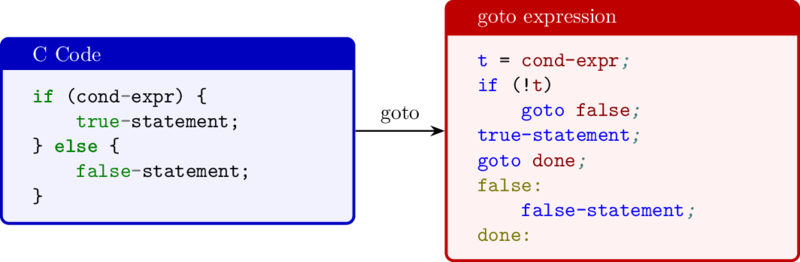
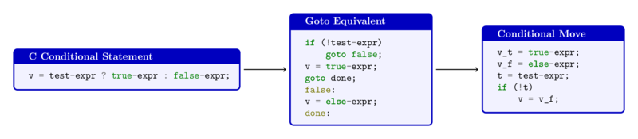
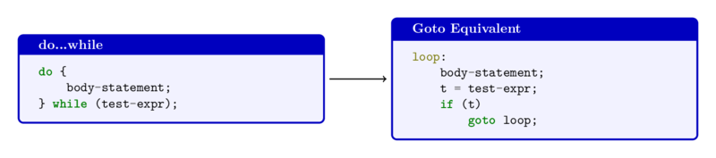
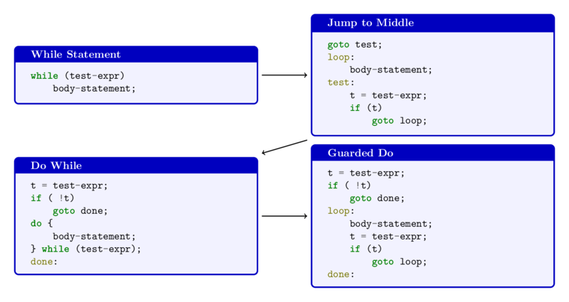

# Machine-Level Representation of Programs
CS:APP3e.ch03

Control Structures
---
- C constructs (e.g., conditionals, loops) use `conditional execution` based on `data tests`.  
- Machine code implements this via `data tests and jump instructions` to alter control flow.  
- Compilers translate C control constructs into low-level machine code mechanisms.

---

## X86-64 CPU Flags (Condition Codes)
| **Flag** | **[VS2022](https://learn.microsoft.com/en-us/visualstudio/debugger/debugging-basics-registers-window?view=vs-2022)** | **Name**   | **Indication**    |
|----------|----------|------------|--------------------|
| **CF**   | `CY` | `Carry` Flag           | the last operation resulted in a `carry-out or borrow (unsigned overflow)`.|
| **ZF**   | `ZR` | `Zero` Flag            | the result of the last operation was `zero`.                               |
| **SF**   | `PL` | `Sign` Flag            | the result of the last operation is `negative (MSB is 1)`.                 |
| **OF**   | `OV` | `Overflow` Flag        | the last operation caused `signed overflow (two's-complement overflow)`.   |
| **PF**   | `PE` | `Parity` Flag          | the number of set bits in the result is `even`.                            |
| **AF**   | `AC` | `Auxiliary Carry` Flag | there was a `carry-out or borrow in the lower nibble (BCD operations)`.    |
| **DF**   | `UP` | `Direction` Flag       | Controls the `direction of string operations` <br> up or increment/down or decrement memory address. |
| **IF**   | `EI` | `Interrupt` Flag       | Enables or disables hardware `interrupts`.                            |
| **TF**   | N/A | `Trap` Flag            | Enables single-step `debugging`.                                      |

- **CF**, **ZF**, **SF**, and **OF** 
  - most commonly used flags for `arithmetic and logical operations`.
- **PF**, **AF**, **DF**, **IF**, and **TF** 
  - used for specific purposes like `BCD arithmetic, string operations, and system-level control`.

- 🍎 [ADD D, S ↔ t = a + b](https://hjlebbink.github.io/x86doc/html/ADD.html)

| **Flag** | **Condition** | **Indication**  |
|-----|---------------|------------------|
| CF  | `(unsigned) t < (unsigned) a`         | Unsigned overflow |
| ZF  | `(t == 0)`                            | Zero result       |
| SF  | `(t < 0)`                             | Negative result   |
| OF  | `(a < 0 == b < 0) && (t < 0 != a < 0)`| Signed overflow   |

- Most instructions set CPU flags
  - [lea](https://www.felixcloutier.com/x86/lea) does NOT

---

## Comparison and Test Instructions
- Set the condition codes without altering any other registers

| **Intel Syntax** | **AT&T Syntax** | **Function** |
|------------------|-----------------|--------------------------|
| `CMP S1, S2`     | `cmpb S2, S1`   | Compare byte             |
| `CMP S1, S2`     | `cmpw S2, S1`   | Compare word             |
| `CMP S1, S2`     | `cmpl S2, S1`   | Compare double word      |
| `CMP S1, S2`     | `cmpq S2, S1`   | Compare quad word        |
| `TEST S1, S2`    | `testb S2, S1`  | Test byte                |
| `TEST S1, S2`    | `testw S2, S1`  | Test word                |
| `TEST S1, S2`    | `testl S2, S1`  | Test double word         |
| `TEST S1, S2`    | `testq S2, S1`  | Test quad word           |

- [CMP](https://www.felixcloutier.com/x86/cmp): 
  - `Compares` two operands without updating the destination;
    - based on `S₁ - S₂`
  - sets flags (`ZF`, `SF`, `CF`, `OF`) for `equality or ordering`.
    - `ZF` ← 1 if `S₁ - S₂=0`; else 0. 
    - `SF` ← 1 if `S₁ - S₂<0`; else 0.
    - `CF` ← 1 if unsigned overflow; else 0.
    - `OF` ← 1 if signed overflow; else 0.
      - (S₂ >0 && S₁ < 0 && S₁ - S₂ <0) || (S₂ < 0 && S₁ > 0 && S₁ - S₂>0)
- [TEST](https://www.felixcloutier.com/x86/test): 
  - Performs `bitwise AND` without updating the destination;
    - based on `S₂ & S₁`
  - sets flags (`ZF`, `SF`) to test for `zero, negative, or specific bits`.
    - `ZF` ← 1 if `S₂ & S₁=0`; else 0. 
    - `SF` ← 1 if `S₂ & S₁<0`; else 0.
    - `CF` ← 0.  `OF` ← 0.
- Machine code often uses the same instructions for signed and unsigned values due to similar bit-level behavior.  
- Some operations require different instructions for signed vs. unsigned handling.
  - e.g., right shifts, division, multiplication, and condition codes
- 📝 Explore [CMP and TEST](./code/ctrl/cmtst.c)

---

## Accessing Condition Codes
- Many instructions act accordingly based on the `condition codes`
  - **SETcc instruction** `set` a single byte to 0 or 1 without altering remaining 7 bytes
    - e.g. the LSB bytes of x86-64 integer registers
    - Typically use `movzbl` to finish job
  - **Conditional jumps** `jump` to different parts of the program
  - **Conditional data transfers** `transfer` data 
- The [SETcc](https://www.felixcloutier.com/x86/setcc) instructions

| **Instruction** | **Synonym** | **Effect**      | **Set condition**            |
|------------|-----------|------------------------|------------------------------|
| `sete D`   | `setz D`  | `D ← ZF`               | Equal (zero)                 |
| `setne D`  | `setnz D` | `D ← ~ZF`              | Not equal (not zero)         |
| `sets D`   |           | `D ← SF`               | Negative                     |
| `setns D`  |           | `D ← ~SF`              | Nonnegative                  |
| `setg D`   | `setnle D`| `D ← ~(SF ^ OF) & ~ZF` | Greater (signed >)           |
| `setge D`  | `setnl D` | `D ← ~(SF ^ OF)`       | Greater or equal (signed >=) |
| `setl D`   | `setnge D`| `D ← SF ^ OF`          | Less (signed <)              |
| `setle D`  | `setng D` | `D ← (SF ^ OF) \| ZF`  | Less or equal (signed <=)    |
| `seta D`   | `setnbe D`| `D ← ~CF & ~ZF`        | Above (unsigned >)           |
| `setae D`  | `setnb D` | `D ← ~CF`              | Above or equal (unsigned >=) |
| `setb D`   | `setnae D`| `D ← CF`               | Below (unsigned <)           |
| `setbe D`  | `setna D` | `D ← CF \| ZF`         | Below or equal (unsigned <=) |

---

## 🍎 Implement C relational operation

| C Code | AT&T Syntax | Intel Syntax | Explanation |
|---------|------------|--------------|-------------|
| `int gt (long x, long y)` | - | - | Function declaration taking two long integers |
| - | `cmpq %rsi, %rdi` | `cmp rdi, rsi` | Compare x (in %rdi) with y (in %rsi) by `x-y` |
| - | `setg %al` | `setg al` | Set lowest byte to 1 if x > y, else 0 |
| - | `movzbl %al, %eax` | `movzx eax, al` | Zero-extend the byte in %al to full 32-bit register %eax |
| `return x > y;` | `ret` | `ret` | Return result (in rax, 1 if true, 0 if false) |

- 📝 Explore [cmp and set instruction](./code/ctrl/comp.c)
  - in assembly [comas.s](./code/ctrl/comas.s) or [comnas.s](./code/ctrl/comnas.s)

---

## 📝 Determine the C code

- 1️⃣ Determine the `data_t` and the `COMP` for each block of assembly codes

```c
// `data_t` is one of C integer types including pointers
int comp(data_t a, data_t b){
  // a in some portion of rdi, b in rsi
  // `COMP` is one of C relational operators (==, !=, <, >, <=, >=)
  return a COMP b;
}
```

generates the assembly codes below:


| **#** | **Intel Syntax**    | **AT&T Syntax**   |
|-------|---------------------------|----------------------------|
| ➊     | `cmp edi, esi`<br>`setl al` | `cmpl %esi, %edi`<br>`setl %al` |
| ➋     | `cmp di, si`<br>`setge al`  | `cmpw %si, %di`<br>`setge %al`  |
| ➌     | `cmp dil, sil`<br>`setbe al` | `cmpb %sil, %dil`<br>`setbe %al` |
| ➍     | `cmp rdi, rsi`<br>`setne al`| `cmpq %rsi, %rdi`<br>`setne %al`|


- 2️⃣ Determine the `data_t` and the `TEST` for each block of assembly codes

```c
// `data_t` is one of C integer types including pointers
int test(data_t a){
  // a in some portion of rdi
  // `TEST` is one of C relational operators (==, !=, <, >, <=, >=) 
  return a TEST 0; 
}
```

generates the assembly codes below:

| **#** | **Intel Syntax**  | **AT&T Syntax**  |
|-------|------------------|----------------|
| ➊ | `test rdi, rdi`<br>`setge al` | `testq %rdi, %rdi`<br>`setge %al` |
| ➋ | `test di, di`<br>`sete al`    | `testw %di, %di`<br>`sete %al`    |
| ➌ | `test dil, dil`<br>`seta al`  | `testb %dil, %dil`<br>`seta %al`  |
| ➍ | `test edi, edi`<br>`setle al` | `testl %edi, %edi`<br>`setle %al` |

---

## Jump Instructions
- redirect execution to a new position usually marked by a `label` in assembly code.
  - `jump target` is the address of the destination instruction in memory
  - two types: [unconditional jumps](https://www.felixcloutier.com/x86/jmp) and [conditional jumps](https://www.felixcloutier.com/x86/jcc)

- 🍎 The assembler calculates `labeled instruction addresses` 
  - encodes `jump targets` as part of the jump instructions.


| **Intel Syntax** | **AT&T Syntax**     | **Description**     |
|------------------|---------------------|---------------------|
| `mov rax, 0`     | `movq $0, %rax`     | Set `%rax` to 0.    |
| `jmp .L1`        | `jmp .L1`           | Jump to label `.L1`.|
| `mov rsi, [rax]` | `movq (%rax), %rsi` | Dereference `%rax` and move to `%rsi`. <br>(Potential null pointer dereference, skipped.) |
| `.L1:`           | `.L1:`              | Define label `.L1`.   |
| `pop rdx`        | `popq %rdx`         | Pop a value from the stack into `%rdx`. |


| **Instruction** | **Synonym** | **Jump Condition**    | **Description**       |
|---------------|-------|-------------------|------------------------------------------|
| `jmp Label`   |       |  1     | `Direct unconditional` jump to a label            |
| `jmp *Operand`|       |  1     | `Indirect unconditional` jump to an `address` in memory or register |
| `je Label`    | `jz`  | `ZF`              | equal (zero)                |
| `jne Label`   | `jnz` | `~ZF`             | not equal (not zero)        |
| `js Label`    |       | `SF`              | negative                    |
| `jns Label`   |       | `~SF`             | nonnegative                 |
| `jg Label`    | `jnle`| `~(SF ^ OF) & ~ZF`| greater (signed >)          |
| `jge Label`   | `jnl` | `~(SF ^ OF)`      | greater or equal (signed >=)|
| `jl Label`    | `jnge`| `SF ^ OF`         | less (signed <)             |
| `jle Label`   | `jng` | `(SF ^ OF) \| ZF` | less or equal (signed <=)   |
| `ja Label`    | `jnbe`| `~CF & ~ZF`       | above (unsigned >)          |
| `jae Label`   | `jnb` | `~CF`             | above or equal (unsigned >=)|
| `jb Label`    | `jnae`| `CF`              | below (unsigned <)          |
| `jbe Label`   | `jna` | `CF \| ZF`        | below or equal (unsigned <=)|

- Indirect jumps: `jmp *Operand`
  - Conditional jumps can only be `direct`

| **Intel Syntax**| **AT&T Syntax**   | **Description**  |
|-------------|----------------|---------------------|
| `jmp rax`   | `jmp *%rax`   | Uses the value in register `rax` as the jump target.   |
| `jmp [rax]` | `jmp *(%rax)` | Reads the jump target from memory with address in `rax`. |

---

## Jump instruction encodings

- **PC-relative jumps**: Encode the `offset` between the `target` and `the instruction following the jump`, using 1, 2, or 4 bytes.  
- **Absolute jumps**: Directly specify the target address with a 4-byte encoding.  
- **Encoding selection**: The assembler and linker determine the appropriate jump encoding based on the target.  

- 🍎 PC-relative [jumps](./code/ctrl/jmp.s)
  - `offset = target - the instruction following the jump`

| **Intel Syntax** | **AT&T Syntax** | **Description**   |
|------------------|-----------------|-------------------|
| `mov rax, rdi`   | `movq %rdi, %rax` | Move the value in `%rdi` to `%rax`.   |
| `jmp .L2`        | `jmp .12`         | Unconditionally jump to label `.L2`.  |
| `.L3:`           | `.13:`            | Define label `.L3`.                   |
| `sar rax`        | `sarq %rax`       | Perform an arithmetic right shift on `%rax`.   |
| `.L2:`           | `.12:`            | Define label `.L2`.                            |
| `test rax, rax`  | `testq %rax, %rax`| Perform a bitwise AND of `%rax` with itself (sets flags).   |
| `jg .L3`         | `jg .13`          | Jump to label `.L3` if greater than (based on flags).        |
| `rep ret`        | `rep; ret`        | Return from the function, with `rep` prefix for compatibility. |

generates object codes, analyze the jump encoding ➊ and ➋ 

```asm
0000000000000000 <_start>:
   0:	48 89 f8             	mov    %rdi,%rax
   3:	eb 03                	jmp    8 <_start+0x8> ;➊ 0x03=0x8-0x5
   5:	48 d1 f8             	sar    %rax
   8:	48 85 c0             	test   %rax,%rax
   b:	7f f8                	jg     5 <_start+0x5> ;➋ 0xf8=0x5-0xd=-8
   d:	f3                   	repz
```

- The instructions can be compactly encoded in just 2 bytes, 
  - allowing the object code to be relocated in memory without any modification. 

```asm
0000000000401000 <_start>:
  401000:	48 89 f8             	mov    %rdi,%rax
  401003:	eb 03                	jmp    401008 <_start+0x8> ;➊
  401005:	48 d1 f8             	sar    %rax
  401008:	48 85 c0             	test   %rax,%rax
  40100b:	7f f8                	jg     401005 <_start+0x5> ;➋
  40100d:	f3                   	repz
```

- 📝 Determine the target addresses

| **Question** | **Machine Code**  | **Intel Syntax**    | **AT&T Syntax**    | **Target Address**  |
|---------|----------------------------------|-------------------------------------------|-------------------------------|---------------------|
| **A.**  | 4003fa: 74 02 <br> 4003fc: ff d0 | `je XXXXXX` <br> `call qword ptr [rax]`   | `je XXXXXX` <br> `call *%rax` | Target of `je` is `XXXXXX` |
| **B.**  | 40042f: 74 f4 <br> 400431: 5d    | `je XXXXXX` <br> `pop rbp`       | `je XXXXXX` <br> `pop %rbp`    | Target of `je` is `XXXXXX` |
| **C.**  | XXXXXX: 77 02 <br> XXXXXX: 5d    | `ja 0x400547` <br> `pop rbp`     | `ja 0x400547` <br> `pop %rbp`  | Address of `ja` and `pop` instructions is `XXXXXX` |
| **D.**  | 4005e8: e9 73 ff ff ff <br> 4005ed: 90| `jmp 0xFFFFFF73` <br> `nop` | `jmp 0xFFFFFF73` <br> `nop`    | Address of jump target is calculated from 4-byte PC-relative offset `0xFFFFFF73` |


- 📝 Analyze the encoding of [jump instructions](./code/ctrl/jumps.c)

---

## Two ways implementing C conditional structures
- **Old way**: `goto`
  - 
- `if⋯else` → `goto`

| if⋯else → | goto |
|-------------------|----------------|
| `long dist(long x, long y)`<br>`{` | `long dist_j(long x, long y)`<br>`{` |
| &nbsp;&nbsp;&nbsp;&nbsp;`long result;` | &nbsp;&nbsp;&nbsp;&nbsp;`long result;` |
| &nbsp;&nbsp;&nbsp;&nbsp;`if (x > y)` | &nbsp;&nbsp;&nbsp;&nbsp;`int ntest = x <= y;` |
| &nbsp;&nbsp;&nbsp;&nbsp;&nbsp;&nbsp;&nbsp;&nbsp;`result = x-y;` | &nbsp;&nbsp;&nbsp;&nbsp;`if (ntest) goto Else;` |
| &nbsp;&nbsp;&nbsp;&nbsp;`else` | &nbsp;&nbsp;&nbsp;&nbsp;`result = x-y;` |
| &nbsp;&nbsp;&nbsp;&nbsp;&nbsp;&nbsp;&nbsp;&nbsp;`result = y-x;` | &nbsp;&nbsp;&nbsp;&nbsp;`goto Done;` |
| &nbsp;&nbsp;&nbsp;&nbsp;`return result;` | `Else:` |
| `}` | &nbsp;&nbsp;&nbsp;&nbsp;`result = y-x;` |
| | `Done:` |
| | &nbsp;&nbsp;&nbsp;&nbsp;`return result;` |
| | `}` |

- `exp ? true_expr : false_expr` → `goto`

| `e?t:f` → | `goto` |
|---|---|
| `val = Test ? True_Expr : False_Expr;` | `ntest = !Test;` |
| | `if (ntest) goto Else;` |
| | `val = True_Expr;` |
| | `goto Done;` |
| | `Else:` |
| | `val = False_Expr;` |
| | `Done:` |


- `Goto` → `jumpcc`

| C Code | AT&T Syntax | Intel Syntax |
|----------|-----------------|--------------|
| `long dist(long x, long y)` | `dist:` x in rdi, y in rsi, return value in rax | `dist:` |
| `if (x > y)` | `cmpq %rsi, %rdi` <br>`jle .L4` | `cmp rdi, rsi` ;x-y<br>`jle .L4` |
| `result = x-y;` | `movq %rdi, %rax`<br>`subq %rsi, %rax`<br>`ret` | `mov rax, rdi`<br>`sub rax, rsi`<br>`ret` |
| `else`<br>`result = y-x;` | `.L4:`<br>`movq %rsi, %rax`<br>`subq %rdi, %rax`<br>`ret` | `.L4:`<br>`mov rax, rsi`<br>`sub rax, rdi`<br>`ret` |

- 📝 Rewrite [`if⋯else` with `goto`](./code/ctrl/dist.c)
- 📝 Disassemble [goat.s](./code/ctrl/goat.s) into C

---

- **New way**: `conditional transfer of data`
  - Branches are very `disruptive` to instruction flow through `pipelines`
    - Conditional moves do not require control transfer
  - Computes `both outcomes` of a conditional operation.
    - `Selects` the outcome based on the condition's truth value.
  - Effective in `limited` cases but optimized for `modern` processors.




- 🍎 `if⋯else` → `conditional assignment`

| `if⋯else` | `conditional assignment` |
|----------------------|-------------|
| `val = Test` | `result = Then_Expr;` |
| `? True_Expr` | `eval = False_Expr;` |
| `: False_Expr;` | `nt = !Test;` |
| | `if (nt) result = eval;` |
| | `return result;` |

- 🍎 `if⋯else` → `cmov`

| **if⋯else** | **`cmov` <br> AT&T Syntax** | **`cmov` <br> Intel Syntax** |
|------------|----------------|------------------|
| `long dist(long x, long y)` | `dist:` x=rdi, y=rsi, retval=rax | `dist:` |
| `{` |  |  |
| `    long result;` |  |  |
| `    if (x > y)` | 😄 | 😄 |
| `        result = x - y;` | `movq %rdi, %rax`<br>`subq %rsi, %rax` | `mov rax, rdi`<br>`sub rax, rsi` |
| `    else` |  |  |
| `        result = y - x;` | `movq %rsi, %rdx`<br>`subq %rdi, %rdx` | `mov rdx, rsi`<br>`sub rdx, rdi` |
| `    return result;` | `cmovle %rdx, %rax` | `cmovle rax, rdx` |
| `}` | `ret` | `ret` |

- 📝 Inspect the [conditional move](./code/ctrl/cmov.c)
  - in [assembly](./code/ctrl/atdist.s)

---

## The [CMOVcc](https://www.felixcloutier.com/x86/cmovcc) instructions
- if cc = true: R ← S

| **Intel Syntax** | **AT&T Syntax**  | **Synonym** | **Move Condition** | **Description**       |
|--------------|---------------|-----------|---------------------|-------------------------------|
| `cmove R, S` | `cmove S, R`  | `cmovz`   | `ZF`               | Equal / Zero                   |
| `cmovne R, S`| `cmovne S, R` | `cmovnz`  | `~ZF`              | Not equal / Not zero           |
| `cmovs R, S` | `cmovs S, R`  | -         | `SF`               | Negative                       |
| `cmovns R, S`| `cmovns S, R` | -         | `~SF`              | Non-negative                   |
| `cmovg R, S` | `cmovg S, R`  | `cmovnle` | `~(SF ^ OF) & ~ZF` | Greater (signed `>`)           |
| `cmovge R, S`| `cmovge S, R` | `cmovnl`  | `~(SF ^ OF)`       | Greater or equal (signed `>=`) |
| `cmovl R, S` | `cmovl S, R`  | `cmovnge` | `(SF ^ OF)`        | Less (signed `<`)              |
| `cmovle R, S`| `cmovle S, R` | `cmovng`  | `(SF ^ OF) \| ZF`  | Less or equal (signed `<=`)    |
| `cmova R, S` | `cmova S, R`  | `cmovnbe` | `~CF & ~ZF`        | Above (unsigned `>`)           |
| `cmovae R, S`| `cmovae S, R` | `cmovnb`  | `~CF`              | Above or equal (unsigned `>=`) |
| `cmovb R, S` | `cmovb S, R`  | `cmovnae` | `CF`               | Below (unsigned `<`)           |
| `cmovbe R, S`| `cmovbe S, R` | `cmovna`  | `CF \| ZF`         | Below or equal (unsigned `<=`) |

---

## MOVcc limitations
- Evaluating both true/false expressions causes errors or side effects such as
  - null pointer dereferencing: `val = p? *p : 0;`
  - `both` values get computed: `val = x > 0 ? x*=7 : x+=3;`
- `Waste` computation if one expression is complex and the condition fails.  
- Compilers favor conditional moves for `simple` cases but avoid them for complex or unpredictable scenarios.

- 📝 Disassemble [exatbrch.s](./code/ctrl/exatbrch.s)

---

## Implement C loop `do while`

- `do while`



- 🍎 `do⋯while` → `goto`

| **`do⋯while`** | **`goto`** |
|-------|------|
| `long count1s_do(unsigned long x) {` | `long count1s_goto(unsigned long x) {`  |
| `    long result = 0;`   | `    long result = 0;` |
| `    do {`  | `loop:`   |
| `        result += x & 0x1;`   | `        result += x & 0x1;`|
| `        x >>= 1;`   | `        x >>= 1;` |
| `    } while (x);`   | `        if (x) goto loop;` |
| `    return result;` | `    return result;`   |
| `}`  | `}` |

- 🍎 `do⋯while` → `jumpcc`

| **do⋯while**   | **jumpcc <br> AT&T Syntax**   | **jumpcc <br> Intel Syntax** |
|----------------------|------------|----------|
| `long count1s_goto(unsigned long x) {`| x=rdi, retval=rax |  |
| `    long result = 0;` | `movl    $0, %eax`| `mov eax, 0`    |
| `loop:` | `.L2:`  | `L2:` |
| `    result += x & 0x1;`    | `movq    %rdi, %rdx`   | `mov rdx, rdi`  |
|    | `andl    $1, %edx`| `and edx, 1`    |
|    | `addq    %rdx, %rax`   | `add rax, rdx`  |
| `    x >>= 1;`    | `shrq  1,  %rdi`    | `shr rdi, 1`    |
| `    if (x) goto loop;`| `jne     .L2`| `jne L2`   |
| `    return result;`   | `rep; ret`   | `ret` |
| `}`||  |


- 📝 Convert [`do while` to `goto`](./code/ctrl/dowhile.c)
  - Disassemble [dowhile.s](./code/ctrl/dowhile.s)

---

## Implement C loop `while`



- 🍎 `while` → `Jump to middle`

| **while**| **Jump to Middle**|
|------|----|
| `long pcount_while(unsigned long x) {`   | `long pcount_goto_jtm(unsigned long x) {`  |
| `    long result = 0;`| `    long result = 0;`  |
| `    while (x) {`| `    goto test;`    |
| `        result += x & 0x1;`    | `loop:`   |
| `        x >>= 1;`    | `    result += x & 0x1;`|
| `    }`| `    x >>= 1;` |
| `    return result;`  | `test:`   |
| `}`| `    if (x) goto loop;` |
|   | `    return result;`    |
|   | `}` |

- 🍎 `while` → `Guarded do`

| **while** | **Guarded do**  |
|----|--|
| `long count1s_while(unsigned long x) {` | `long count1s_goto_dw(unsigned long x) {`   |
| `    long result = 0;`    | `    long result = 0;` |
| `    while (x) {`  | `    if (!x) goto done;`|
| `        result += x & 0x1;`| `loop:`  |
| `        x >>= 1;` | `    result += x & 0x1;` |
| `    }`| `    x >>= 1;`   |
| `    return result;` | `    if (x) goto loop;`|
| `}`   | `done:`  |
| | `    return result;`   |
| | `}` |

- 📝 Convert [`while` to `goto`](./code/ctrl/while.c)
  - Disassemble [while.s](./code/ctrl/while.s)

---

## Implement C loop  `for`


- 🍎 `for` → `while`

| **for** | **while** |
|--------|------|
| `long count1s_for(unsigned long x) {`  | `long count1s_for_while(unsigned long x) {`|
| `    size_t i;` | `    size_t i;` |
| `    long result = 0;`| `    long result = 0;` |
| `    for (i = 0; i < WSIZE; i++)` | `    i = 0;` |
| `    {`| `    while (i < WSIZE)`|
|  | `    {` |
| `        unsigned bit = (x >> i) & 0x1;` | `        unsigned bit = (x >> i) & 0x1;` |
| `        result += bit;` | `        result += bit;`  |
|  | `        i++;`  |
| `    }` | `    }` |
| `    return result;` | `    return result;` |
| `}` | `}`|

- 🍎 `for` → `do while`

| **for**| **do while**|
|-------|--------|
| `long count1s_for(unsigned long x) {`| `long count1s_for_goto_dw(unsigned long x) {` |
| `    size_t i;` | `    size_t i;` |
| `    long result = 0;` | `    long result = 0;`|
| `    for (i = 0; i < WSIZE; i++)` | `    i = 0;`  |
| `    {` | `    if (!(i < WSIZE)) goto done;` |
| | `loop:` |
| `        unsigned bit = (x >> i) & 0x1;` | `        unsigned bit = (x >> i) & 0x1;` |
| `        result += bit;`  | `        result += bit;`  |
| | `    i++;` |
| | `    if (i < WSIZE) goto loop;` |
|`    }`| `done:` |
|`    return result;` | `    return result;`|
| `}` | `}`  |

- 📝 Convert [`for` to `goto`](./code/ctrl/for.c)
  - Disassemble [for.s](./code/ctrl/for.s)

---

## Switch statement

```c
long switch_eg(long x, long y, long z)
{
    long w = 1;
    switch(x) {
    case 1:
        w = y*z;
        break;
    case 2:
        w = y/z;
        /* Fall Through */
    case 3:
        w += z;
        break;
    // Missing case 4
    case 5: // Multiple case labels
    case 6:
        w -= z;
        break;
    default:
        w = 2;
    }
    return w;
}
```

- A switch statement enables `multiway branching` based on an integer index, 
  - improving readability and efficiency.
- It uses a `jump table` to map indices to corresponding code segments.
  - Implemented in GNU C as an *extension*: `goto *jump_table[x];`
- `Jump tables` provide `faster` performance than if-else statements, 
  - especially for cases with a small range of values.

| **switch** | **Jump Table** | | **Jump Targets**  |
|----|------------|--|-------------------|
| case val_0:<br> Block 0 | `targ0`    |  → | `targ0: code block 0`|
| case val_1:<br> Block 1| `targ1`    |  → | `targ1: code block 1`|
| case val_2:<br> Block 2| `targ2`    |  → | `targ2: code block 2`|
| `...` | `...`      |  → | `...`                |
| case val_n-1:<br> Block n-1| `targ(n-1)`|  → | `targ(n-1): code block n-1` |

---

## 🍎 `switch` → `jump table`
- **Range Check:** Ensure `switch value` is within `valid case range`.
- **Jump Table:** Create an `array` of case `label addresses`.
- **Index Calculation:** Calculate `jump table index` from `switch value`.
- **Load Address:** Load case label address from jump table.
- **Indirect Jump:** Jump to loaded address.
- **Handle Cases:** Implement code for each case including `default`.
- **Fallthrough:** `Omit jump` for `fallthrough` cases.
- **Multiple Labels:** `Duplicate jump` table entries for `multiple case` labels.


```python
switch_eg:
        pushq   %rbp
        movq    %rsp, %rbp

        movl    $1, -8(%rbp)  # w = 1

        cmpq    $6, %rdi       # Compare x with 6
        jg      .Ldefault       # Jump to default if x > 6

        cmpq    $1, %rdi       # Compare x with 1
        jl      .Ldefault       # Jump to default if x < 1

        # Jump table
        movq    switch_table(,%rdi,8), %rax  # Load address from jump table
        jmp     *%rax                      # Indirect jump

switch_table:
        .quad   .Lcase1        # Case 1
        .quad   .Lcase2        # Case 2
        .quad   .Lcase3        # Case 3
        .quad   .Ldefault      # Case 4 (missing, falls through to default)
        .quad   .Lcase5        # Case 5
        .quad   .Lcase5        # Case 6 (same as case 5)

.Lcase1:
        movq    %rsi, %rax     # y in rax
        imulq   %rdx, %rax     # w = y * z
        movq    %rax, -8(%rbp) # store w
        jmp     .Lend

.Lcase2:
        movq    %rsi, %rax     # y in rax
        cqo                     # Prepare for division (sign-extend rax into rdx:rax)
        idivq   %rdx             # w = y / z
        movq    %rax, -8(%rbp)  # store w

.Lcase3:
        movq    -8(%rbp), %rax # load w
        addq    %rdx, %rax     # w += z
        movq    %rax, -8(%rbp)  # store w
        jmp     .Lend

.Lcase5:
        movq    -8(%rbp), %rax # load w
        subq    %rdx, %rax     # w -= z
        movq    %rax, -8(%rbp)  # store w
        jmp     .Lend

.Ldefault:
        movq    $2, -8(%rbp)  # w = 2

.Lend:
        movq    -8(%rbp), %rax # load w
        movq    %rbp, %rsp
        popq    %rbp
        ret
```

- 📝 Convert [`switch` to `goto`](./code/ctrl/switch.c)
  - Disassemble [sj.s](./code/ctrl/sj.s), [switch.s](./code/ctrl/switch.s), and [inswitch.s](./code/ctrl/inswitch.s)
- ☠️ GNU c extension: [pointer to label](./code/ctrl/dlabel.c)

---

## References
- [Intel® 64 and IA-32 Architectures Software Developer’s Manual Combined Volumes](https://www.intel.com/content/www/us/en/content-details/782158/intel-64-and-ia-32-architectures-software-developer-s-manual-combined-volumes-1-2a-2b-2c-2d-3a-3b-3c-3d-and-4.html)
  - [x86-64 Instructions Set](https://linasm.sourceforge.net/docs/instructions/index.php)
  - [x86 and amd64 instruction reference](https://www.felixcloutier.com/x86/)