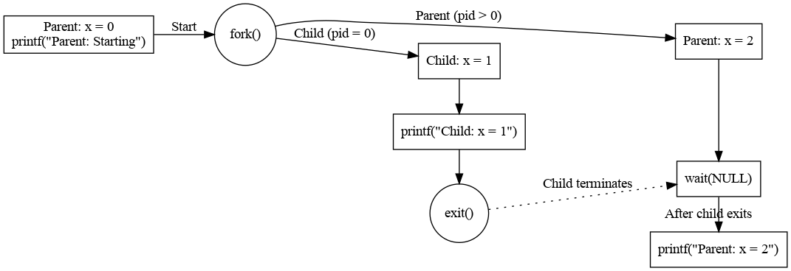

# Exceptional control flow
CS:APP3e.ch08


---

## Overview

- **Control Flow & Transfers**  
   - The processor executes `a sequence of instructions (control flow)`, 
     - with `transitions` between addresses (control transfers).  
   - Smooth flow is interrupted by `jumps, calls, and returns`, 
     - while `exceptional control flow (ECF)` handles abrupt changes due to external events.  
- **ECF Across System Levels**  
   - **Hardware**: Triggers exceptions (e.g., `interrupts`, `timer events`).  
   - **OS**: Manages `context switches` between processes and system calls (traps).  
   - **Applications**: Uses signals, nonlocal jumps (`setjmp`/`longjmp`), and software exceptions (`try`/`catch`).  
- **ECF Enables `OS-Application Interaction`**  
   - `System calls` allow programs to request OS services
     - e.g., I/O, process creation.  
   - `Signals and interrupts` enable `responses to external events`
     - e.g., child process termination, network packets.  
- **ECF Supports `Concurrency & Error Handling`**  
   - Enables overlapping execution (e.g., threads, interrupts).  
   - Facilitates error recovery via exceptions and nonlocal jumps.  
- **Why ECF Matters**  
   - Key to understanding processes, I/O, and virtual memory.  
   - Essential for building systems software (e.g., shells, servers) and `handling real-world events` efficiently.


---

# Exceptions

- Exceptions are `abrupt control flow changes` implemented jointly by `hardware (detection) and OS (handling)` in response to processor state changes.
  - `Event triggers` can be 
    - instruction-related (arithmetic overflow, page fault) 
    - or external (timer interrupt, I/O completion), detected during execution.
  - Processor `routes control via exception table` to specific `OS subroutines (handlers)` that process each event type.
  - Handlers may retry current instruction, resume next instruction, terminate program  
    - depending on event type.

---

## Exception Handling

- **Hardware detects, software handles**  
   - CPU triggers exceptions via numbered events, OS provides handlers in exception table  
   - Kernel-mode execution with full privileges  
- **State saved automatically**  
   - Processor pushes context (registers, return address) to kernel stack  
   - Clean restoration via special return instruction  
- **Three resolution paths**  
   - Retry current instruction (e.g., page fault)  
   - Resume next instruction (e.g., interrupt)  
   - Terminate process (e.g., segmentation fault)  
- **Unified system interface**  
   - Handles both hardware faults and software traps (e.g., system calls)  
   - Secure user/kernel transitions with context isolation

---

## Classes of Exceptions

| Class| Cause  | Async/Sync | Return Behavior  |
|-----------|----------|------------|---------|
| Interrupt | Signal from I/O device| Async | Always returns to next|
|   | |    | instruction   |
| Trap | Intentional exception | Sync  | Always returns to next|
|   | (e.g., system calls)   |    | instruction   |
| Fault| Potentially recoverable error  | Sync  | Might return to current  |
|   | (e.g., page fault)|    | instruction   |
| Abort| Nonrecoverable error   | Sync  | Never returns |

- **Interrupts (Asynchronous)**  
  - External hardware-triggered (I/O devices, timers)  
  - Always resumes next instruction after handling  
  - Uses dedicated interrupt pins and bus signals  
- **Traps (Intentional Synchronous)**  
  - Deliberate exceptions for system calls (e.g., syscall instructions)  
  - Enables controlled user-to-kernel mode transitions  
  - Returns to next instruction after service completion  
- **Faults (Recoverable Synchronous)**  
  - Correctable execution errors (e.g., page faults, protection violations)  
  - Handler may fix and retry faulting instruction or escalate to abort  
  - Critical for virtual memory and protection mechanisms  
- **Aborts (Fatal Synchronous)**  
  - Unrecoverable hardware/software failures (e.g., parity errors)  
  - Terminates offending process immediately  
  - Kernel handles cleanup without return  
- **System-Wide Exception Architecture**  
  - Unified numbering (0-255) covering CPU/OS-defined cases  
  - All classes use exception table for handler dispatch  
  - Hardware/OS collaboration enables secure control transfers  
  - Synchronous (instruction-linked) vs. async (external) distinction fundamental to design
- 🍎 Example exceptions in x86-64 systems

| Exception Number | Description               | Exception Class      |
|------------------|---------------------------|----------------------|
| 0                | Divide error              | Fault                |
| 13               | General protection fault  | Fault                |
| 14               | Page fault               | Fault                |
| 18               | Machine check            | Abort                |
| 32-255           | OS-defined exceptions     | Interrupt or Trap    |

---

## Exceptions in Linux/x86-64 Systems

- **CPU vs. OS Exception Types**  
   - **0-31**: Hardware-defined (faults/aborts like divide error, page fault, machine check)  
   - **32-255**: OS-defined (interrupts/traps including system calls)  
   - Critical faults trigger termination (e.g., #13 GPF → "Segmentation fault")  
- **Recoverable vs. Fatal Exceptions**  
   - **Faults** (e.g., #14 page fault): Kernel fixes issue and retries instruction  
   - **Aborts** (e.g., #18 machine check): Unrecoverable → process termination  
   - **Traps**: Intentional (e.g., syscalls) → always resume next instruction  
- **System Call Mechanism**  
   - Invoked via `syscall` instruction with:  
     - `%rax` = call number (e.g., 1=write, 60=exit)  
     - Args in `%rdi`, `%rsi`, `%rdx` (up to 6 registers)  
   - Returns result in `%rax`; negative values indicate errors  
- **User/Kernel Transition**  
   - Syscalls switch to kernel mode automatically  
   - C wrappers (e.g., `write()`) simplify invocation  
   - Assembly example:  
     ```asm
     movq $1, %rax  ; write() syscall
     movq $1, %rdi  ; stdout
     syscall
     ```
- **Unified Exception Handling**  
   - All exceptions use jump tables (CPU exception table + OS syscall table)  
   - Hardware saves state before handler execution  
   - Sync (traps/faults) vs. async (interrupts) determine resumption behavior

---

# Linux System Calls
System calls are **fundamental to Linux operations**, enabling secure and controlled access to kernel resources. 
- What They Are  
  - **Bridge between user and kernel space** – System calls (syscalls) allow user programs to request services from the Linux kernel (e.g., file operations, process control, networking).  
  - **Examples**: `read()`, `write()`, `fork()`, `open()`, `kill()`.  
- How They Work  
  - **Triggered via software interrupt (`int 0x80` or `syscall` instruction)** – The CPU switches to kernel mode, executes the syscall, then returns to user mode.  
  - **Defined in the kernel** – Each syscall has a unique number (e.g., `exit` = 60 on x86_64).  
- Common Categories  
  - **Process control** (`fork()`, `execve()`, `exit()`)  
  - **File management** (`open()`, `read()`, `write()`)  
  - **Device management** (`ioctl()`, `mmap()`)  
  - **Communication** (`pipe()`, `shmget()`)  
  - **System info** (`getpid()`, `time()`).  
- Performance Impact  
  - **Context switching is expensive** – Each syscall involves switching from user to kernel mode and back.  
  - **Minimized via batching** (e.g., `readv()` instead of multiple `read()` calls).  
- How to Trace Them  
  - **`strace` command** – Shows syscalls made by a process:  
    ```sh
    strace ls -l
    ```
  - **In C**: Use `syscall(SYS_<name>, ...)` for direct invocation.  
    - Fast Modern Syscalls
    - **`syscall` (x86_64) is faster than `int 0x80`** – Newer CPUs optimize syscall entry/exit.  

---

# Instruction [syscall](https://www.felixcloutier.com/x86/syscall) vs. [int 0x80](https://www.felixcloutier.com/x86/intn:into:int3:int1)

| **Feature**   | **`syscall` (x86_64)** | **`int 0x80` (x86 32-bit)** |
|------|----------|--------|
| **Architecture**   | 64-bit (x86_64, AMD64) | 32-bit (x86)   |
| **Purpose**    | Invoke system calls in 64-bit mode| Invoke system calls in 32-bit mode   |
| **Introduced By**  | AMD (with AMD64 architecture)   | Intel (legacy x86 interrupt mechanism)   |
| **Performance**| Faster (optimized for 64-bit, direct entry point) | Slower (uses interrupt handling, more overhead) |
| **Calling Convention**    | Uses registers: `rax` (syscall number), `rdi`, `rsi`, `rdx`, `r10`, `r8`, `r9` for arguments | Uses registers: `eax` (syscall number), `ebx`, `ecx`, `edx`, `esi`, `edi` for arguments |
| **Argument Passing** | 64-bit registers, up to 6 arguments directly | 32-bit registers, up to 6 arguments directly    |
| **Return Value**   | Returned in `rax`| Returned in `eax`  |
| **Stack Usage**| No implicit stack usage for arguments  | No implicit stack usage for arguments|
| **Entry Point**| Kernel’s `syscall` handler (e.g., via MSRs on Linux) | Interrupt Descriptor Table (IDT) vector 0x80    |
| **Compatibility**  | Native to 64-bit OS, not supported in 32-bit mode | Supported in 32-bit OS, works in 64-bit compat mode |
| **Usage in Linux** | Default for 64-bit binaries | Legacy, used for 32-bit binaries (slower on x86_64) |
| **Overhead**   | Low (direct jump to kernel via Model-Specific Registers) | Higher (interrupt handling adds cycles)  |
| **Example**    | `mov rax, 1; mov rdi, 1; syscall` (write)  | `mov eax, 4; mov ebx, 1; int 0x80` (write) |

---

# 🔭 [Linux Syscall](https://filippo.io/linux-syscall-table/)

| Number | Name    | Description                           |
|--------|---------|---------------------------------------|
| 0      | read    | Read file                             |
| 1      | write   | Write file                            |
| 2      | open    | Open file                             |
| 3      | close   | Close file                            |
| 4      | stat    | Get info about file                   |
| 9      | mmap    | Map memory page to file               |
| 12     | brk     | Reset the top of the heap             |
| 32     | dup2    | Copy file descriptor                  |
| 33     | pause   | Suspend process until signal arrives  |
| 37     | alarm   | Schedule delivery of alarm signal     |
| 39     | getpid  | Get process ID                        |
| 57     | fork    | Create process                        |
| 59     | execve  | Execute a program                     |
| 60     | _exit   | Terminate process                     |
| 61     | wait4   | Wait for a process to terminate       |
| 62     | kill    | Send signal to a process              |

- 💡 [syscall and exceptions](./code/ec/sysrwf.c)

---

# System Call Error Handling

- **Error Reporting Mechanism**  
   - Unix system calls return `-1` on failure and set `errno` to indicate specific errors  
   - Proper error checking is essential but often omitted for brevity  
- **Basic Error Handling**  
   - Manual checks require verbose conditionals and `strerror(errno)` for error messages  
   - Example:  
     ```c
     if ((pid = fork()) < 0) { 
         fprintf(stderr, "fork error: %s\n", strerror(errno)); 
         exit(0); 
     }
     ```
- **Simplification with Helper Functions**  
   - Wrappers like `unix_error()` consolidate error reporting and termination:  
     ```c
     if ((pid = fork()) < 0) 
         unix_error("fork error");
     ```
- **Stevens-Style Wrappers**  
   - Capitalized wrappers (e.g., `Fork()`) automate error checking:  
     ```c
     pid_t Fork(void) {
         pid_t pid;
         if ((pid = fork()) < 0) 
             unix_error("Fork error");
         return pid;
     }
     ```
   - Usage becomes concise: `pid = Fork();`
- **Design Philosophy**  
   - Wrappers maintain code clarity while enforcing error checking  
   - Base system calls (e.g., `fork`) are referenced in text, but wrappers (e.g., `Fork`) are used in examples  
   - 💡 A consistent error handling demo in [csapp.h](./code/ec/csapp.h), [csapp.c](./code/ec/csapp.c)

---

# Processes

- Processes are `instance of executing program` with private state (memory, registers, files)  
- **Execution Context**  
   - Maintains code/data/stack segments, register states, and kernel structures  
   - `User-space (application code)` and `kernel-space (OS services)` memory separation  
- **Privilege Hierarchy**  
   - Dual-mode operation: user mode (restricted) vs kernel mode (full access)  
   - System calls (traps) enable controlled transitions to kernel mode
- **Kernel Interfaces**  
   - System calls provide controlled access to OS services  
   - /proc filesystem exposes kernel data to user space 
- **Address Space Protection**  
   - Each process gets isolated virtual address space  
   - Hardware prevents unauthorized memory access between processes 
- **Context Switching**  
   - Scheduler saves/restores process state (registers, PC, memory maps)  
   - Triggered by system calls, interrupts, or scheduler timeouts   
- **Scheduling Triggers**  
   - Voluntary: Process blocks on I/O or sleep()  
   - Involuntary: Timer interrupts force preemption  
- **Concurrency Mechanisms**  
   - Processes run `concurrently` via rapid `context switching`  
   - `Parallelism` achieved when processes run on `multiple cores`  
- **Performance Tradeoffs**  
    - Context switches enable multitasking but incur overhead  
    - Protection mechanisms add security at cost of complexity  


---

# Linux Commands for Manipulating Processes

| Tool/Command | Description | Example Usage   |
|---|---------|---|
| `strace` | Traces system calls made by a process and its children| `strace -f ./myprogram`|
| `ps`   | Lists all processes in the system (including zombies) | `ps aux` or `ps -ef` |
| `top`  | Displays dynamic real-time view of system resource usage  | `top`|
| `pmap` | Shows memory mapping of a process| `pmap -x <PID>`|
| `/proc` filesystem | Virtual filesystem exposing kernel data structures in readable format | `cat /proc/loadavg`  |
|  | | `cat /proc/<PID>/maps` |

---

# 🛠️ Process Management

| **Purpose**    | **Linux Command**    | **Windows Command**    | **PowerShell Cmdlet**    |
|-----|------|--------|----------|
| List running processes   | `ps aux`  | `tasklist`   | `Get-Process`  |
| Show process details| `ps -p <PID>`  | `tasklist /FI "PID eq <PID>"` | `Get-Process -Id <PID>`  |
| Kill/terminate process   | `kill <PID>`   | `taskkill /PID <PID>`  | `Stop-Process -Id <PID>` |
| Force kill process  | `kill -9 <PID>`| `taskkill /PID <PID> /F`    | `Stop-Process -Id <PID> -Force` |
| Start a process| `<command> &`  | `start <program>` | `Start-Process <program>`|
| Show process CPU usage   | `top`| `tasklist /V`| `Get-Process \| Select-Object CPU` |
| Show process memory usage| `top`| `tasklist /V`| `Get-Process \| Select-Object WS` |
| List processes by name   | `ps aux \| grep <name>`  | `tasklist /FI "IMAGENAME eq <name>"` | `Get-Process <name>`   |
| Suspend a process   | `kill -STOP <PID>`  | (No direct equivalent) | `Suspend-Process` (custom)    |
| Resume a process    | `kill -CONT <PID>`  | (No direct equivalent) | `Resume-Process` (custom)|
| Set process priority| `nice -n <value> <command>` | `start /<priority> <program>` | `Get-Process \| Set-ProcessPriority` |
| Monitor processes   | `htop` (if installed)    | `perfmon`    | `Get-Process \| Format-Table` |
| **Show process tree**    | `pstree`  | `wmic process get processid,parentprocessid,executablepath` | `Get-Process \| Select-Object Name,Id,Parent` |

---


# Process Control API

- **Process Lifecycle & States**
   - Created via `fork()` (copies parent's memory/descriptors, returns 0 in child/PID in parent)  
   - States: Running, Stopped (signals), Terminated (exit/signal/return)  
   - Zombies (unreaped terminated processes) persist until collected via `waitpid()` by their parents 
   - Orphans adopted by init process (PID 1)  
- **Program Execution & Environment**
   - `execve()` replaces process image (loads new program, preserves PID)  
   - Inherits: Open files, environment vars (`getenv`/`setenv`), working directory  
   - Argument passing via `argv[]` (program name + args) and `envp[]` (name=value pairs)  
   - Shells combine `fork()`+`execve()` (+ `waitpid()` for foreground jobs)  
- **Process Control & Synchronization**
   - `waitpid()` with options (WNOHANG/WUNTRACED) for flexible child monitoring  
   - Status macros decode termination (WIFEXITED, WTERMSIG, etc.)  
   - `sleep()`/`pause()` for timed waits or signal suspension  
   - Concurrent execution requires explicit synchronization to avoid races  
- **Isolation & Resource Management**
   - Private virtual address spaces (copy-on-write optimization)  
   - Process groups for shell job control (foreground/background)  
   - System resource limits (max PIDs, CPU/memory) enforced by kernel  
   - Security context (UID/GID) inherited unless SUID/SGID set  
- **Error Handling & Signals**
   - System calls return -1/`errno` on failure (e.g., ECHILD for no children)  
   - Signals (SIGSTOP/SIGCONT/SIGTERM) for interrupts/process control  
   - Default signal handlers can be overridden  
   - Critical for robust programs (especially servers/shells)  
- ⚒️ Practice [fork0 to fork11](./code/ec/forks/)

---

## Linux process API

| **Function**  | **Usage**  |**Parameters**  |**Return Value**  |
|---------|-----|----------|---------|
| `fork()`      | Creates a new child process by duplicating the calling process | None   |In parent: PID of child (>0), In child: 0, On error: -1 |
| `getpid()`    | Gets the process ID (PID) of the calling process | None   |PID of the calling process (pid_t) |
| `getppid()`   | Gets the parent process ID (PPID) of the calling process | None   |PPID of the calling process (pid_t)|
| `execve()`    | Replaces the current process image with a new one | `const char *pathname` (program path), `char *const argv[]` (arguments), `char *const envp[]` (environment) | On success: does not return, On error: -1   |
| `wait()`      | Waits for any child process to terminate       | None   |PID of terminated child, On error: -1       |
| `waitpid()`   | Waits for a specific child process to terminate | `pid_t pid` (child PID or group), `int *wstatus` (status info), `int options` (behavior flags) | PID of terminated child, 0 if waiting, On error: -1  |
| `exit()`      | Terminates the calling process       | `int status` (exit status code)   |Does not return; process terminates|
| `kill()`      | Sends a signal to a process | `pid_t pid` (target PID), `int sig` (signal number) | 0 on success, -1 on error |
| `nice()`      | Changes process priority    | `int inc` (priority increment)    |New nice value on success, -1 on error      |
| `sched_yield()` | Yields processor to other processes | None   |0 on success, -1 on error |

- 💡 Demo
  - [fork, execve, and wait](./code/ec/few.c)
  - [process graph](./code/ec/pgragh.c)
  - 

- ⚒️ Practice: 
  - predict the outputs and draw process graph
    - [fork1](./code/ec/fork1.c)
    - [forks](./code/ec/forks2.c)
  - execute programs
    - [execs](./code/ec/execs.c)
    - [shellex](./code/ec/shellex.c)

---

# Signals

- **Core Signal Mechanics**
  - Software interrupts delivering 30+ event types (SIGINT, SIGSEGV, etc.)
  - Generated by kernel (hardware exceptions) or processes (kill/alarm)
  - Immediate delivery to target process(es) or groups, with pending state tracking
- **Handler Implementation**
  - Customizable responses via signal()/sigaction() (except SIGKILL/STOP)
  - Async execution requires reentrant code and protected shared state
  - Critical safety rules: minimal logic, only async-safe functions, errno preservation
- **Process Control Patterns**
  - SIGCHLD for child monitoring with waitpid() synchronization
  - SIGALRM for timeouts and scheduled operations
  - Job control via SIGTSTP/SIGCONT for shell management
  - Graceful shutdown handling (SIGTERM vs SIGKILL)
- **Concurrency Challenges**
  - Race conditions from non-queued signals and async delivery
  - Atomic operation requirements for global variables
  - Safe synchronization using sigprocmask() and sigsuspend()
  - System call interruption handling (EINTR recovery)
- **Modern Best Practices**
  - Prefer sigaction() over signal() for portability
  - Replace signal-driven designs with event loops where possible
  - Use dedicated signal threads in complex applications
  - Implement fallback timeouts for signal-based waits
  - Audit handlers for security vulnerabilities
- ⚒️ Practice [fork12 to fork17](./code/ec/forks/)
  - [waitforsignal](./code/ec/waitforsignal.c)
  - [internal signal](./code/ec/internal.c)
  - [sigint](./code/ec/sigint.c)
  - [sigintsafe](./code/ec/sigintsafe.c)
  - [sigsuspend](./code/ec/sigsuspend.c)
  - [signaldeadlock](./code/ec/signaldeadlock.c)
  - signal blocking
    - [sigmask1](./code/ec/procmask1.c)
    - [sigmask2](./code/ec/procmask2.c)
    - [signal_block](./code/ec/signal_block.c)


---

# Nonlocal jumps

- **Core Mechanism**
  - `setjmp` saves execution context (registers/stack) in a `jmp_buf` buffer
  - `longjmp` restores saved context, resuming from original `setjmp` call
  - Enables direct jumps across function stack frames without normal unwinding
- **Key Characteristics**
  - `setjmp` returns twice: initially (0) and after each `longjmp` (nonzero)
  - `longjmp` never returns, bypassing intermediate function cleanup
  - Requires careful variable handling (only `volatile` vars preserved)
- **Primary Use Cases**
  - Emergency exits from deep call stacks (error handling)
  - Signal handler recovery (using `sigsetjmp`/`siglongjmp` variants)
  - Implementing custom control flow (e.g., soft restarts)
- **Critical Considerations**
  - Potential memory leaks (skipped cleanup code)
  - Thread-unsafe (single jmp_buf per execution context)
  - Restricted usage in signal handlers (async-safety concerns)
- **Best Practices**
  - Initialize jump buffers before signal handler installation
  - Mark modified variables as `volatile`
  - Prefer modern alternatives (exceptions, state machines) where possible
  - Limit to well-defined error recovery paths
  - Avoid in complex multi-threaded applications
- ⚒️ Practice 
  - [setjmp](./code/ec/setjmp.c)
  - [restart](./code/ec/restart.c)
  - [longjmp2](./code/ec/longjmp2.c)
  - [longjmp3](./code/ec/longjmp3.c)


---

# References
- [System calls on Windows x64](https://n4r1b.com/posts/2019/03/system-calls-on-windows-x64/)
- [signal(7) — Linux manual page](https://man7.org/linux/man-pages/man7/signal.7.html)
- [Open Computer Systems Fundamentals](https://w3.cs.jmu.edu/kirkpams/OpenCSF)

